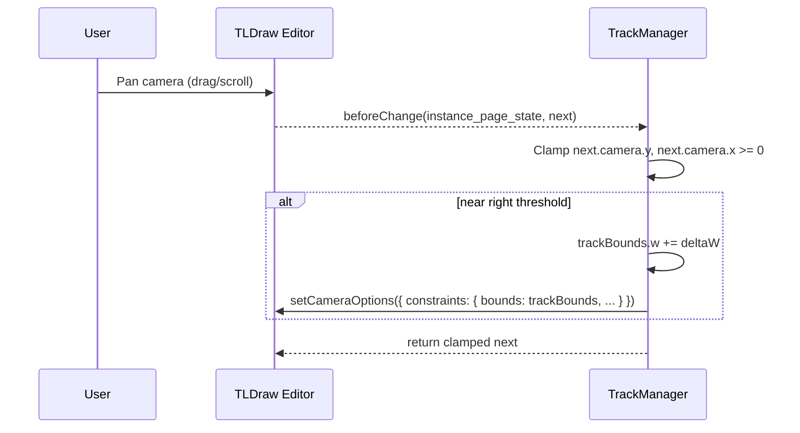
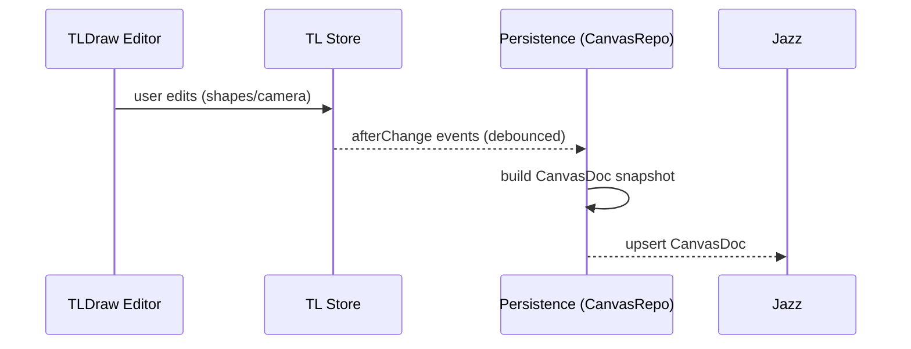

### TLDraw canvas plan: horizontal camera track, zoom limits, grid snap

This document isolates the TLDraw APIs we need and proposes an implementation plan to constrain the camera to a single horizontal track, limit zoom-out, enable snap-to-grid, and persist state via Jazz Tools.

### Scope
- **Camera track**: movement constrained to x ≥ 0 along a band of fixed height; extends to the right as needed.
- **Zoom**: can zoom in arbitrarily; cannot zoom out beyond a defined minimum zoom.
- **Grid**: all shapes snap to a configurable grid.
- **Persistence**: persist canvas and track state via Jazz Tools; offline-first, real-time ready.

### Relevant TLDraw API surfaces (v3)
- **Mount + editor**: `onMount={(editor) => {...}}` returns `Editor`.
- **Camera constraints**: `editor.setCameraOptions({ constraints: { bounds, behavior, origin, padding, baseZoom, initialZoom } })`.
- **Camera ops**: `editor.zoomToBounds(bounds, opts)`, `editor.getCamera()`, `editor.setCamera({ x, y, z })`.
- **Reactive values**: `useValue(key, fn, deps)` for derived state.
- **Transactions**: `transact(() => { ... })` for batched updates.
- **Side effects / guards**: `editor.sideEffects.registerBeforeChangeHandler(kind, (prev, next) => next)` for:
  - `shape` (quantize positions/sizes → grid snap)
  - `instance_page_state` (clamp camera position/zoom; filter selection)
- **Shapes**: `editor.createShape`, `editor.updateShape`, `createShapeId`.
- **Events**: `markEventAsHandled` for UI controls embedded via `components`.

### Design: single horizontal track

- **Track bounds model**: `trackBounds = { x: 0, y: 0, w: W, h: H }` with H fixed (e.g., viewport-like height) and W dynamically extended when needed.
- **Containment**: `behavior: 'contain'` with `origin: { x: 0.5, y: 0.5 }` and padding to keep content comfortably in view.
- **Left, top constraints**: y clamped so camera center stays within [0, H]; x clamped so camera never moves left of x=0.
- **Right infinity**: start with large W (e.g., several slide widths). When the camera’s right edge approaches `trackBounds.x + trackBounds.w - threshold`, extend `trackBounds.w += deltaW` and call `setCameraOptions(...)` again. This preserves the illusion of infinite rightward extent without unbounded numbers.
- **Zoom-out limit**: clamp camera zoom in a before-change handler on `instance_page_state`. Define `MIN_ZOOM` independent of `trackBounds.w`, so increasing track length does not force a smaller minimum zoom.
- **Zoom-in**: no upper bound other than TLDraw’s internal max; allow `zoomBy`/pinch as normal.

Mermaid sequence: pan near right edge → extend track


### Adapting the TLDraw Slides example (single long track)

We’ll keep the structure and UI of the provided example for inclusion in the TLDraw examples list; only semantic changes are:

- Replace `SlidesManager` with `TrackManager` that exposes:
  - `getTrackBounds(): { x, y, w, h }`
  - `extendLeft()` / `extendRight()` (wired to existing + buttons)
  - `scrollLeft()` / `scrollRight()` (wired to `<` and `>` controls to pan by one “segment” width)
  - Constants: `SEGMENT_SIZE = SLIDE_SIZE.w`, `TRACK_HEIGHT = SLIDE_SIZE.h`
- In `InsideSlidesContext`:
  - On mount and whenever bounds change, call `editor.setCameraOptions({ constraints: { bounds: trackBounds, behavior: 'contain', origin: { x: 0.5, y: 0.5 }, baseZoom: 'fit-max', initialZoom: 'fit-max', padding: { x: 50, y: 50 } } })` and `editor.zoomToBounds(trackBounds, { force: true })` on first mount.
  - Register `beforeChange('instance_page_state')` to:
    - Clamp `next.camera.y` within the track’s vertical band
    - Clamp `next.camera.x >= 0`
    - Clamp `next.camera.z = Math.max(next.camera.z, MIN_ZOOM)`
- Keep `components` usage unchanged. Repurpose the between-segment + buttons to call `extendRight()`; the far-left + calls `extendLeft()` (optional) and the far-right + calls `extendRight()`.
- Remove frame-shape creation or leave it as optional “ruler segments” (non-interactive). If kept, do not treat them as pages; set locked/ignored in selection via the existing before-change selection filter.

Pseudocode outline
```ts
// InsideSlidesContext (renamed locally but keep export name if required by examples list)
useEffect(() => {
  if (!editor) return
  const bounds = track.getTrackBounds()
  editor.setCameraOptions({ constraints: { bounds, behavior: 'contain', origin: { x: 0.5, y: 0.5 }, baseZoom: 'fit-max', initialZoom: 'fit-max', padding: { x: 50, y: 50 } } })
}, [editor, trackBoundsKey])

useEffect(() => {
  if (!editor) return
  const unsub = editor.sideEffects.registerBeforeChangeHandler('instance_page_state', (prev, next) => {
    const z = Math.max(next.camera.z, MIN_ZOOM)
    const y = clamp(next.camera.y, track.top, track.top + track.h)
    const x = Math.max(next.camera.x, track.left)
    next.camera = { ...next.camera, x, y, z }
    return next
  })
  return () => unsub()
}, [editor, trackBoundsKey])
```

### Zoom constraints
- **Minimum zoom**: application constant `MIN_ZOOM` (empirically chosen for readability). Enforced in `beforeChange('instance_page_state')`.
- **Fit behavior**: use `baseZoom: 'fit-max'` and `initialZoom: 'fit-max'` for first paint; after that, user can zoom.
- **Note**: If TLDraw exposes `constraints.zoomBounds` or `minZoom`/`maxZoom`, prefer those over manual clamping; otherwise, manual clamping is robust and coexists with `contain`.

### Grid snapping (to implement after camera)
- **Approach**: global quantization via `beforeChange('shape')` for all shape updates (create, move, resize). Quantize `x`, `y`, `w`, `h`, and relevant props to a grid size `GRID = 8` (configurable).
- **Precision**: snap both top-left and size to avoid drift; handle rotation by snapping center and using quantized sizes when resizing.
- **Selection filters**: ensure non-interactive “ruler segments” (if any) are excluded from selection as in the example.

Quantization helper
```ts
const snap = (n: number, grid = GRID) => Math.round(n / grid) * grid
editor.sideEffects.registerBeforeChangeHandler('shape', (prev, next) => {
  if (next.type === 'frame' && next.meta?.ruler) return prev // optional: do not alter rulers
  const x = snap(next.x)
  const y = snap(next.y)
  const props = { ...next.props }
  if (typeof props.w === 'number') props.w = snap(props.w)
  if (typeof props.h === 'number') props.h = snap(props.h)
  return { ...next, x, y, props }
})
```

### Persistence with Jazz Tools

Goals: autosave, restore, offline-first, multi-tab-safe; later enable collaborative sync.

- **Data model**
  - `CanvasDoc`: top-level document keyed by `canvasId`
    - `track`: `{ h: number, w: number, padding: { x: number, y: number } }`
    - `camera`: `{ x: number, y: number, z: number }`
    - `store`: TLDraw store snapshot (pages, shapes, bindings, assets, instance page state minimal)
    - `prefs`: `{ grid: number, minZoom: number }`
- **Write path**
  - Subscribe to TLDraw store changes (e.g., `editor.store.listen(...)` or `editor.store.onAfterChange`); debounce (250ms); persist diffs or snapshots into a Jazz Tools collection.
  - On camera change (via the same `beforeChange` hook), stage camera values to the doc.
- **Read path**
  - On mount, attempt to load `CanvasDoc` by `canvasId`; if present, hydrate TLDraw store via `editor.store.loadSnapshot(...)` (or iterate and create shapes), then apply `track` and `camera`.
- **Tech**
  - Use `jazz-tools/react` provider and hooks (0.15+ single-package). Use `$jazz.set`/`$jazz.push` for updates (0.18+ API).
  - Wrap persistence in a small `CanvasRepo` with `{ load(canvasId), save(canvasId, payload) }`.

Mermaid sequence: autosave on changes


### Acceptance criteria
- Camera never pans above/below track height or left of x=0.
- Panning right extends the track seamlessly without visible jumps.
- Zoom-out halts at `MIN_ZOOM` while zoom-in works smoothly.
- All created/moved/resized shapes end up at grid-aligned positions/sizes.
- Refreshing the page restores shapes, camera, and track dimensions from Jazz Tools.

### Open questions / risks
- TLDraw may expose explicit `minZoom`/`maxZoom` constraints; if available, prefer them to manual clamping.
- Very large `trackBounds.w` values can affect initial `fit-max` min zoom; mitigate by decoupling `MIN_ZOOM` and using dynamic extension instead of gigantic initial width.
- Quantizing rotated shapes requires careful UX; consider snapping center only during rotation.

### Next steps
1) Implement camera track and min-zoom clamp.
2) Add grid snapping via `beforeChange('shape')`.
3) Integrate Jazz Tools persistence (load/save, debounce, offline).
4) Polish the example for inclusion in TLDraw examples list.


### Progress
- Implemented the single-track camera constraints with min zoom clamp in `src/examples/SlideShowTrackExample.tsx`. Camera is clamped to x ≥ 0 and within track height, and zoom-out is limited to `MIN_ZOOM`.
- Preserved example structure and UI (buttons and components) while adapting semantics to a single long track.
- Wired example as the app’s root in `src/App.tsx` and imported TLDraw CSS.

- Reset example to verbatim camera behavior (per TLDraw slides example) to ensure we match expected UX exactly before adapting to a single long track. Extracted `SlidesManager` to `src/examples/SlidesManager.tsx` without decorators.

- Increased slide width to create much longer horizontal slides (`SLIDE_SIZE.w = 4000`).
- Enabled snap-to-grid using TLDraw’s grid mode (`isGridMode: true`) with a custom `Grid` component that draws nothing (invisible gridlines).

### Learnings
- TLDraw’s `constraints.behavior: 'contain'` works well with a dynamic bounds model; additional camera clamps via `beforeChange('instance_page_state')` are still needed for min zoom and strict banding.
- Keeping `baseZoom/initialZoom: 'fit-max'` plus a one-time `zoomToBounds` yields a stable first paint; subsequent zooming respects the min clamp.
- Decorators aren’t enabled in the default Vite React setup; avoid `@computed` in examples and use regular methods.

### Status checklist
- [x] Vite React TS scaffold verified; TLDraw v3.15.4 installed and current
- [x] Example restored verbatim: per-slide camera constraints and transitions
- [x] Slides widened horizontally (`SLIDE_SIZE.w = 4000`)
- [x] Snap-to-grid active with invisible gridlines (custom `Grid`, `isGridMode: true`)
- [ ] Single long horizontal track (one “page”); preserve example camera options
- [ ] Zoom-out minimum enforced within track (if not covered by constraints)
- [ ] Persist TLDraw store + camera/track to Jazz Tools
- [ ] Optional: shape-level quantization hook for deterministic sizes/positions

### Implementation plan (remaining)
1) Single long track (no multiple pages)
   - Replace multi-slide bounds with a single track bounds object `{ x: 0, y: 0, w: W, h: H }`.
   - Maintain the example’s camera options (contain, fit-max, origin, padding); call `setCameraOptions`/`zoomToBounds` on mount and when the track grows.
   - Grow `W` on demand when panning near the right edge; avoid huge initial `W` to keep base zoom practical.

2) Zoom policy
   - If available, set `minZoom` via constraints; else, register `beforeChange('camera')` to clamp `z >= MIN_ZOOM`.
   - Keep zoom-in unlimited.

3) Persistence (Jazz Tools)
   - Add `CanvasRepo` with `load(canvasId)` / `save(canvasId, snapshot)`.
   - Snapshot: `{ storeSnapshot, camera, track, prefs }`.
   - Debounce `editor.store` changes (≈250ms) and camera changes; upsert to Jazz.
   - On mount: load, hydrate store, then apply `track` and `camera` before first render.

4) Grid snapping consistency (optional)
   - Keep `isGridMode: true` for UX.
   - Optionally add `beforeChange('shape')` quantization for `x, y, w, h` to ensure persisted values are grid-aligned even if shapes are created programmatically.

5) Example polish
   - Keep UI and structure identical to the TLDraw example; only semantics differ (one long track).
   - Provide a short README blurb and link for the examples list.


