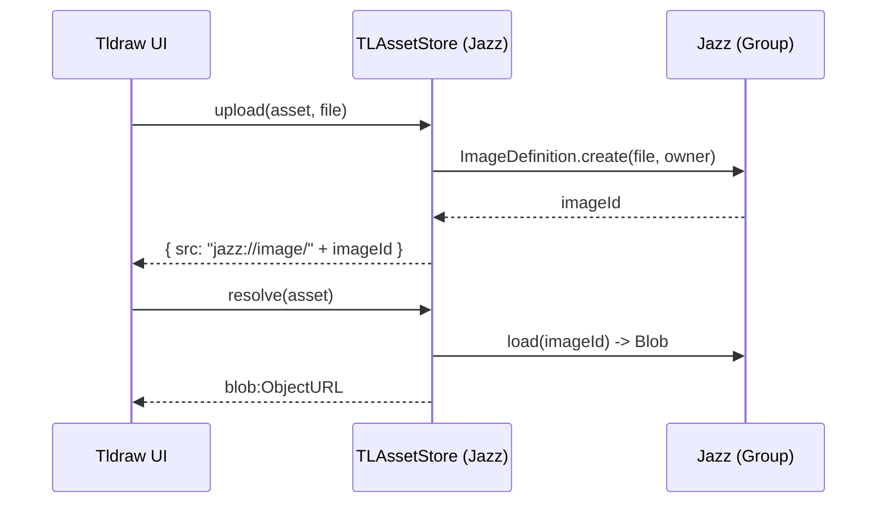

## TLDraw hosted assets persisted in Jazz — plan/spec

### Goals
- Persist user-uploaded images for TLDraw shapes via Jazz, not data URLs.
- Keep TL snapshots small/stable; make asset `src` values durable across sessions/devices.
- Avoid adding a traditional REST backend; use Jazz ownership/permissions.

### References
- tldraw Assets overview: [`https://tldraw.dev/docs/assets`](https://tldraw.dev/docs/assets)
- tldraw simple server example (asset store patterns): [`https://github.com/tldraw/tldraw/blob/main/templates/simple-server-example/src/client/App.tsx`](https://github.com/tldraw/tldraw/blob/main/templates/simple-server-example/src/client/App.tsx)
- Jazz 0.17 image API upgrade: [`https://jazz.tools/docs/react/upgrade/0-17-0`](https://jazz.tools/docs/react/upgrade/0-17-0)
- Jazz FileStreams (for non-image binaries): [`https://jazz.tools/docs/react/using-covalues/filestreams#writing-to-filestreams`](https://jazz.tools/docs/react/using-covalues/filestreams#writing-to-filestreams)
- Jazz ImageDefinition docs: [`https://jazz.tools/docs/react/using-covalues/imagedef`](https://jazz.tools/docs/react/using-covalues/imagedef)
- Internal conventions: `docs/jazz-reference.md` (Groups, tri‑state, mutations).

### Current state (what we have)
- Editor lives in `src/examples/SlideShowTrackExample.tsx` and uses `<Tldraw ... />`.
- Canvas state is persisted to Jazz via `useCanvasPersistence(editor, key)` which stores a TL snapshot JSON string in `CanvasDoc.snapshot` (`src/jazz/useCanvasPersistence.ts`, `src/jazz/schema.ts`).
- No custom `assets` prop is passed to `<Tldraw>` yet; only `assetUrls` for static icons.

### Design summary (updated for Jazz 0.17)
Add a TLAssetStore whose upload path uses the new Jazz image APIs and whose resolve path turns Jazz IDs into runtime URLs.

- Upload: On image insert, `upload(asset, file)` calls `createImage(file, { owner: canvasDoc._owner, placeholder?: false | "blur", progressive?: false })` from `jazz-tools/media` and returns `src: "jazz://image/<image.id>"`. This aligns with the 0.17 refactor to `createImage` and progressive/placeholder options. See upgrade guide: [`https://jazz.tools/docs/react/upgrade/0-17-0`](https://jazz.tools/docs/react/upgrade/0-17-0).
- Resolve: For `jazz://image/<id>`, use `loadImage(id)` (or `loadImageBySize` if we later know a target size) from `jazz-tools/media` to fetch a Blob, then create a cached `blob:` URL for TLDraw. Non‑Jazz `src` values pass through unchanged.
- Snapshot: TL snapshot still stores only a string `src` (our durable `jazz://` URL), keeping JSON small and portable.

This mirrors tldraw’s asset store contract while keeping storage and permissions in Jazz, following the hosted-image pattern from tldraw docs while avoiding a separate REST server.

### Schema updates
- Keep the TL `src` as the canonical pointer `jazz://image/<imageId>` and store image objects in Jazz.
- Optional bookkeeping on the canvas for management/GC:
  - `ImageAsset = co.map({ tlAssetId: z.string(), image: ImageDefinition, name: z.string().optional(), mime: z.string().optional() })` (ImageDefinition is still the high-level abstraction for images; see docs: [`https://jazz.tools/docs/react/using-covalues/imagedef`](https://jazz.tools/docs/react/using-covalues/imagedef))
  - `CanvasDoc.assets = co.list(ImageAsset)`
- Migration: lazily create `assets` on first insertion to avoid breaking existing data.

### Asset store API and behavior
- Construction: the store needs the owning Group (from the active `CanvasDoc`) and read/write access. Expose a hook `useJazzAssetStore(canvasDoc)` that returns a memoized `TLAssetStore | null` gated by tri‑state and permissions.
- Upload flow (async):
  - Input: `asset` (tldraw meta), `file: File`.
  - Call `createImage(file, { owner: canvasDoc._owner, placeholder: false, progressive: false })` from `jazz-tools/media`.
  - Optionally push an `ImageAsset { tlAssetId, image }` entry to `canvasDoc.assets`.
  - Return `{ src: "jazz://image/<image.id>" }`.
- Resolve flow (async):
  - If `src` starts with `jazz://image/`, parse `<id>`, call `loadImage(id)` (or `loadImageBySize` later) to get a Blob, and create `URL.createObjectURL`.
  - Cache by image ID; `revokeObjectURL` on unmount/eviction.
  - Else return `asset.props.src` unchanged.

Mermaid — high level sequence


### Integration points
- `src/examples/SlideShowTrackExample.tsx`
  - Add a `useJazzAssetStore(canvasDoc)` hook (new file `src/jazz/useJazzAssetStore.ts`) and pass its result to `<Tldraw assets={...} />`.
  - The hook depends on `useCanvasPersistence`’s `canvasDoc` state; only provide the store when both `editor` is mounted and `canvasDoc` is loaded (tri‑state guards per `docs/jazz-reference.md`).
- Keep `assetUrls` overrides for static icons as‑is.

### Function signatures (sketch)
```ts
// schema additions
export const ImageAsset = co.map({
  tlAssetId: z.string(),
  image: ImageDefinition,
  name: z.string().optional(),
  mime: z.string().optional(),
});

// in CanvasDoc
assets?: co.list(ImageAsset)

// runtime hook
export function useJazzAssetStore(canvasDoc: LoadedCanvasDoc | null): TLAssetStore | null

// media helpers per 0.17
import { createImage, loadImage, loadImageBySize } from 'jazz-tools/media'
```

### Edge cases and constraints
- Tri‑state: don’t create or resolve assets until `me` and `canvasDoc` are non‑null.
- Permissions: write uses the `CanvasDoc`’s owner Group; readers need read access to resolve images.
- Cleanup: revoke object URLs when components unmount or when evicting from cache.
- Backfill: existing `http(s)://...` `src` values pass through unchanged.
- 0.17 specifics: progressive/placeholder are opt‑in at creation; we start with originals‑only for simplicity and predictable `loadImage` behavior. See upgrade guide: [`https://jazz.tools/docs/react/upgrade/0-17-0`](https://jazz.tools/docs/react/upgrade/0-17-0).

### Alternative (optional later)
- Server URL approach per tldraw example: stand up a Worker HTTP endpoint to accept file POSTs and return permanent `https://…` URLs; `resolve()` returns the same URL. Useful for CDN delivery or signed URLs. See the example app pattern: [`https://github.com/tldraw/tldraw/blob/main/templates/simple-server-example/src/client/App.tsx`](https://github.com/tldraw/tldraw/blob/main/templates/simple-server-example/src/client/App.tsx).

### Note on non-image binaries (Voice memos)
- For audio/video and arbitrary files, use `FileStream` in Jazz rather than ImageDefinition. Creation typically uses `FileStream.createFromBlob(file, owner)` and follows the upload lifecycle outlined here: [`https://jazz.tools/docs/react/using-covalues/filestreams#writing-to-filestreams`](https://jazz.tools/docs/react/using-covalues/filestreams#writing-to-filestreams). We can later add a parallel TLAssetStore for audio if needed.

### Test plan
- Upload an image; verify TL shape renders and `CanvasDoc.snapshot` now contains `jazz://image/<id>`.
- Refresh; verify resolve path loads from Jazz and renders.
- Share account to another browser; verify permissioned rendering and cache behavior.
- Large images: verify no freezes; consider downscaling at upload in a future iteration if needed.

### Rollout
- Land schema + hook + wiring guarded behind existing UI.
- No breaking changes to existing snapshots; old images keep working.

