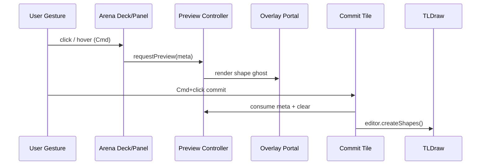
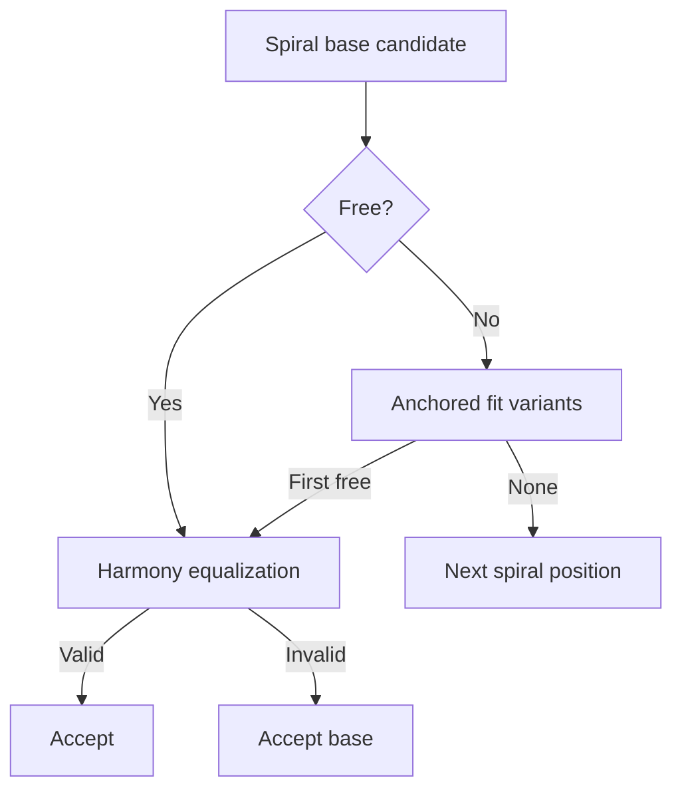

## Tiling-First Layout Spec (with Collision Avoidance)

### Purpose
- Produce harmonious, low-cognitive-load layouts by “tiling” related shapes next to their source.
- Make collision avoidance an implementation detail that keeps tiles neat and predictable.

### Core Concepts
- Anchor shape `A`: the shape from which a new related shape is opened/created.
- Gap `g`: constant spacing between tiles in page space (grid-aligned).
- Grid size `G`: snapping unit for position and size.
- Candidate tile `T`: proposed bounds `(x_T, y_T, w_T, h_T)`.
- Orientation: `row` if `w_A ≥ h_A`, else `column`.

### Tiling Rules
- Row-oriented anchors (`w_A ≥ h_A`):
  1) Primary: place to the right of `A` with same height (`h_T = h_A`), left-aligned top (`x = A.right + g`, `y = A.y`).
  2) Fallback: place below `A`, left-aligned, same height (`x = A.x`, `y = A.bottom + g`).
  3) Local search (bounded): sweep right along the row in grid steps within a limited horizontal window; if blocked, scan a limited number of rows below (see Search-Space Limiting).
- Column-oriented anchors (`w_A < h_A`):
  1) Primary: place below `A` with same width or same height (choose one), aligned `x = A.x`.
  2) Fallback: place to the right of `A` with alignment.
  3) Local search (bounded): sweep down in grid steps within a limited vertical window; if blocked, scan a limited number of columns to the right.
- Always snap `(x_T, y_T, w_T, h_T)` to `G` before validation.

### Interaction
- Preview: hold Cmd (meta) to preview the best available tile `T` at reduced opacity; do not create the shape yet.
- Commit: while holding Cmd, click to create at `T` in a single transaction. If `T` becomes invalid, recompute; if still invalid, cancel.

### TLDraw APIs (concise)
- Bounds/selection/page: `editor.getShapePageBounds(idOrShape)`, `editor.getSelectedShapeIds()`, `editor.getCurrentPageShapeIds()`.
- Spatial queries (prefer internal index): `editor.getShapesAtPoint(point, opts)` and (if available) bounds query e.g. `editor.getShapesInBounds(bounds, opts)`.
- Inputs: `editor.inputs.metaKey` (Cmd), `editor.inputs.shiftKey`, etc.
- Transactions: `transact` for atomic creation.

### Search-Space Limiting (Efficiency)
- Window bounds:
  - Row orientation: `x ∈ [A.x, A.x + W_max]`, `y ∈ [A.y, A.y + R_max]` where `W_max` caps horizontal exploration and `R_max` caps number of row drops (rows × (h_T + g)).
  - Column orientation: `y ∈ [A.y, A.y + H_max]`, `x ∈ [A.x, A.x + C_max]` where `H_max` caps vertical exploration and `C_max` caps number of column steps.
- Neighbor-first candidates:
  - Query immediate neighbors via spatial index near `A.right + g` (row) or `A.bottom + g` (column); generate candidates against neighbor edges first (good locality and fewer misses).
- Early exit:
  - Accept the first valid candidate; do not continue scanning once one is found.
- Dynamic caps:
  - Start with small caps (e.g., 4–8 steps); if no candidate found and the user keeps holding Cmd, progressively expand by a few steps (amortized smoothness without initial cost).

### Lane Interval Index (Optional, Fast)
- Maintain per-page occupancy by grid lanes to avoid scanning:
  - Row lane `r = floor(y / G)` → sorted disjoint x-intervals of occupied spans.
  - Column lane `c = floor(x / G)` → sorted disjoint y-intervals of occupied spans.
- Query cost:
  - Row orientation: choose target lane(s) from `y_T..y_T + h_T`, intersect intervals to find the next free x-slot ≥ `A.right + g`.
  - Column orientation: analogous using column lanes and y-slots.
- Updates:
  - On shape create/move/resize/delete, merge/split affected lane intervals. O(log n) per edit.
- Still confirm with editor spatial query before commit to handle off-lane shapes or stale state.

### Parameters (Defaults)
- Grid `G`: 8–16 px typical. Gap `g`: 1–2 × `G`.
- Window caps (initial): `W_max = 8 * (w_A + g)`, `R_max = 3 * (h_T + g)`; column analogs `H_max`, `C_max` similar.
- Epsilon for AABB contact: `ε = 0.5–1 px`.

### Pseudocode (Candidate Generation)
```pseudo
function nextTileCandidates(anchor A, dims (w_T, h_T), grid G, gap g, orient):
  snapToGrid(A, G)
  if orient == row:
    yield (A.right + g, A.y, w_T, h_T)   // right
    yield (A.x, A.bottom + g, w_T, h_T)  // below
    for rowDrop in 0..R_cap:
      y = A.bottom + g + rowDrop * (h_T + g)
      for step in 0..W_cap:
        x = A.x + step * G
        yield (x, y, w_T, h_T)
  else: // column
    yield (A.x, A.bottom + g, w_T, h_T)  // below
    yield (A.right + g, A.y, w_T, h_T)   // right
    for colStep in 0..C_cap:
      x = A.right + g + colStep * (w_T + g)
      for step in 0..H_cap:
        y = A.y + step * G
        yield (x, y, w_T, h_T)
```

Validation (first-fit): for each yielded candidate, snap to grid, check lane intervals (if enabled), then confirm via `editor` spatial index; accept first passing candidate.

### Tiling Flow
```mermaid
flowchart TD
  A[Anchor shape A chosen] --> B[Determine orientation]
  B --> C[Generate primary candidate]
  C --> D[Snap to grid G & apply gap g]
  D --> E[Validate (collision & policy)]
  E -- Free --> F[Use candidate]
  E -- Blocked --> G[Generate next candidate]
  G --> D
```

### Collision Avoidance (Subgoal)
- Goal: ensure candidates and interactive transforms never overlap obstacles.
- Broad phase:
  - Build candidate AABB for the proposed `T` (or transform step).
  - Query obstacles via editor spatial index (prefer bounds query; fallback: filter page shapes by AABB intersection using `getShapePageBounds`).
  - Exclude active selection; include locked shapes as blockers; ignore hidden/ghost if policy dictates.
  - Use a small epsilon to avoid flicker on contacts.
- Translate clamp (during drag):
  - Snap proposal first; binary search along motion vector to find maximal non-colliding travel; or grid-step along vector before binary search refinement.
- Resize clamp (during drag):
  - Snap proposed `w/h` first; clamp moving edges to nearest obstacle boundary; enforce min size and prevent axis inversion.
- Release:
  - Revalidate and minimally deflate/offset to remove marginal overlaps while staying grid-aligned.
- Optional caching:
  - Default to editor’s spatial index.
  - For hot paths, build a per-interaction RBush of obstacle AABBs; discard on interaction end.
  - If lane intervals are enabled, most candidates are pruned before editor queries.

### Implementation Notes (for Coding Agent)
- Where to hook:
  - Tiling: central utility invoked from Cmd+hover/press context; uses editor to compute AABB of `A`, generate candidates, and validate.
  - Preview: render-only ghost; no shape creation until commit; recompute candidate on viewport zoom or scene mutation.
  - Commit: wrap creation in `transact`; ensure props (w/h) are snapped and persisted.
- Refs and reuse:
  - Cache `A`’s AABB, `w_A/h_A`, `w_T/h_T`, and neighbor lists while Cmd is held; invalidate on scene changes.
  - During transforms, reuse the same broad-phase/collision code path used here for validation.
- Feature flags:
  - Start with editor spatial queries only; guard the lane-index behind a flag and enable after profiling.

### Acceptance Criteria
- Tiling places new shapes predictably: right-then-below for row orientation, below-then-right for column orientation, preserving gap and grid.
- Preview never overlaps obstacles; commit yields a valid placement without visual jump.
- Transforms remain collision-free, feel smooth, and respect grid/min-size.

### Preview/Commit Flow
```mermaid
flowchart TD
  K[Cmd held (inputs.metaKey)] --> L[Compute best candidate T]
  L --> M[Render ghost preview]
  M --> N{Cmd+Click?}
  N -- No --> L
  N -- Yes --> O[Revalidate T]
  O -- Valid --> P[transact(create at T)]
  O -- Invalid --> Q[Cancel or recompute]
```

### Notes
- Keep this logic at the editor layer (before-change side effects for transforms; centralized candidate evaluation for tiling).
- Do not modify shape components for these behaviors.

### Implementation Snapshot (Sept 2025)
- `src/arena/tiling/` contains the core utilities described above: candidate generation, page-bounds clamping, collision filtering, preview orchestration, and commit scaffolding.
- `TilingPreviewManager` (registered in TLDraw overlays) drives Cmd-hover previews and Cmd+click creation. It dynamically switches the anchor to the hovered shape when meta is held and keeps the ghost tile inside the current page bounds.
- Preview collision checks rely on TLDraw’s spatial queries; `ignoreIds` ensures the anchor/hover shapes don’t block themselves. Page bounds are respected before validation, so ghost tiles never spill outside the slide workspace.
- Hook usage lesson: avoid calling TLDraw hooks (`useEditor`, `useValue`) inside helper functions. Compute IDs externally and pass concrete editors/bounds to plain functions—prevents “invalid hook call” errors (see the fix in `TilingPreviewManager`).
- Cmd+click commits currently create a bare `3d-box` (channel/user wiring still TODO). The pattern is ready for richer shape creation once we wire content props.
- Next focus: translate/resize clamps (Stage 5 onward), lane index & RBush perf follow-ups, and aligning preview visuals with TLDraw’s camera (e.g., scale-aware overlay if needed).

### Rich Shape Preview Plan (Richer Creation)
- Bring previews into the Cmd+hover/commit loop while showing the actual shape visuals (not just bounding boxes).
- Centralize preview state in a lightweight controller (e.g., `useArenaPreview`) that owns a TLDraw-compatible portal for rendering shape react-components.
- When `ArenaDeck`, `ConnectionsPanel`, or label interactions fire, they hand off content metadata to the controller instead of creating shapes immediately.
- Preview controller decides whether to display an `ArenaBlockShape`, `ThreeDBoxShape`, or `ArenaUserChannelsIndex` instance, reusing existing shape components so users see the real UI before committing.
- Commit path still flows through `commitTile`, but creation callbacks now hydrate props (channel slug, user metadata, block details) captured during preview.
- Isolation rules: preview ghost is read-only, auto-clears on pointer cancel or when camera/selection context changes.




### Debugging & Alignment Fix (Sept 2025)

- What we observed:
  - Solid orange box = real TLDraw anchor AABB (on-screen bounds).
  - Dashed gray box = snapped anchor (x/y floored to grid; w/h ceiled).
  - Green candidate boxes initially aligned with the dashed box, not with the orange box → visual misalignment.

- Root causes:
  - Candidates were generated from the snapped anchor AABB, not the real on-screen AABB, so their `x/y` inherited the snapped offset.
  - Occasional double-snapping of positions (generation + clamp) introduced extra nudge.
  - Row sweep once stepped by grid, producing overlapping candidates in dense regions.

- Final behavior (concise):
  - Candidate positions are derived from the real anchor AABB; only sizes are snapped once.
    - Right: `(x = A.right + g, y = A.y)`
    - Below: `(x = A.x, y = A.bottom + g)`
    - Row sweep: `x = A.right + g + n * (w_T + g)`, `y = A.y`
    - Row drops: `y = A.bottom + g + r * (h_T + g)`, `x = A.x + n * (w_T + g)`
    - Column analogs use `h_T + g` vertically and `w_T + g` horizontally.
  - Size snapping: `w_T/h_T` are snapped once (ceil to grid) so spacing strides are stable.
  - Clamp: page-bounds clamp no longer re-snaps `x/y`; it only clamps inside the page.
  - Collision policy: we continue to ignore the active ids (`ignoreIds`) for adjacency but block with both the real anchor AABB and the snapped anchor AABB (belt-and-suspenders).
  - Early exit remains: accept the first free candidate.

- Overlay & debugging:
  - Overlay now renders:
    - Real anchor (solid orange)
    - Snapped anchor (dashed gray, debug-only)
    - Candidate samples (accepted in green; rejections colored by reason)
  - Debug samples are collected during preview when `debug` is enabled, with structured console logs summarizing counts and acceptance.

- Outcomes:
  - Green candidates align perfectly with the orange anchor edges.
  - Row/column sweeps are evenly spaced (no overlapping “carpet”).
  - Candidates are never accepted on top of the anchor.

```mermaid
flowchart LR
  A[Real Anchor AABB] --> B[Generate primary + sweeps\nusing real A.x/y]
  B --> C[Snap sizes once\n(w_T/h_T on grid)]
  C --> D[Clamp to page (no re-snap)]
  D --> E[Collision check\n(ignoreIds; block real+snapped A)]
  E -- first free --> F[Preview/Commit]
```

Notes for future work:
- If we introduce camera scaling overlays, ensure overlay coordinates are in page-space to avoid sub-pixel drift.
- If we later adopt lane indices, they should operate on the real-anchor-derived positions to preserve visual alignment.

### Spiral Tiling, Page Gap, and Harmony (Sept 2025)

- Spiral mode:
  - Always start Right of the anchor, then continue clockwise in an outward spiral of tile-sized strides.
  - Generator yields only base positions; first-fit remains the policy.
- Page-edge gap:
  - All previews and commits respect an inset page bounds `(page ⊖ pageGap)`. Candidates outside the inset are rejected/clamped.
  - `pageGap` defaults to `gap` and can be tuned per context.
- Minimum sizes:
  - Enforced via `minWidth/minHeight` (default to grid). Fit attempts never shrink below these.
- Anchored fit-to-space:
  - When blocked, shrink along the adjacency axis while keeping the anchored edge fixed (e.g., right-of anchor → shrink width from the right; below → shrink height from the bottom).
  - Variants are tried in order after the base; still first-fit.
- Harmony equalization (final pass):
  - After a free variant is found, shrink to match the gap to the nearest opposite boundary (page edge or neighbor) to the gap with the anchor, yielding proportional spacing.
  - Changes remain within the page inset and collision-free; otherwise the pre-harmony variant is kept.
- Commit clamp:
  - On commit, final bounds are clamped into the page inset as a safety with no re-snap of x/y.


