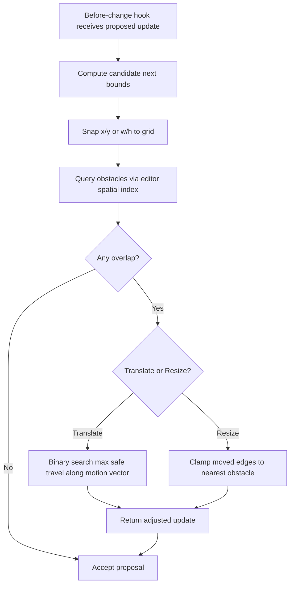

## Collision‑Free Transforms (Move/Resize) Spec for `3d-box`

### Goal
- Enforce non-overlapping transforms for `3d-box` (and optionally other shapes) while preserving a responsive, grid-aware UX.
- While moving, the shape continuously clamps to the nearest non-colliding position.
- While resizing, the shape clamps to the largest non-colliding size.
- On release, if still marginally intersecting, it “shrinks/snaps” to the nearest non-colliding bounds.

### Non-Goals
- No changes to shape components; logic lives at the editor/interaction layer.
- No per-shape custom gestures; this is a general constraint applied via editor hooks.

### Behavioral Requirements
- Translate:
  - Proposed positions must be snapped to the grid first.
  - If proposed bounds intersect any obstacle, reduce travel along the motion vector to the maximal non-colliding distance.
- Resize:
  - Proposed `w/h` are snapped to grid first.
  - If proposed bounds intersect any obstacle, clamp the moved edges/corner to the nearest obstacle boundary that yields no overlap.
- Release:
  - Re-run validation, then slightly deflate/offset if necessary to remove marginal overlaps introduced by snapping.
- Obstacles:
  - Include all non-selected, visible shapes. Treat locked shapes as hard obstacles. Ignore hidden/ghost shapes if they shouldn’t block.
- Minimums:
  - Respect min size constraints (prevent inversion, zero-size, or negative scale).

### TLDraw APIs and Anchors
- Bounds / zoom already used in `ThreeDBoxShape.tsx`:
  - `editor.getShapePageBounds(shape)` – page-space AABB for fast broad-phase.
  - `editor.getViewportPageBounds()` – viewport AABB (reference, not required for collisions).
  - `editor.getZoomLevel()` – for UI metrics only.
- Spatial queries (prefer built-in index):
  - Point-level: `editor.getShapesAtPoint(point, opts)`
  - Bounds-level: use a bounds query if available in your version (e.g., `editor.getShapesInBounds(bounds, opts)`). If not available, fall back to filtering `editor.getCurrentPageShapeIds()` by `getShapePageBounds` AABB intersection.
- Selection / page shape access:
  - `editor.getSelectedShapeIds()`
  - `editor.getCurrentPageShapeIds()`
- Transform interception (central enforcement):
  - Use the “prevent shape change” style before-change side effects (as in TLDraw’s example). The hook name varies by version; attach a before-update handler that receives proposed shape updates and returns modified (clamped) updates.
  - Scope: runs during pointer-driven translate/resize and on final commit.

### High-Level Flow


### Grid Strategy
- Use the app’s grid step (e.g., `gridSize`) for both position and size.
- Snap first, then collide: snapping reduces candidate states and flicker.
- If TLDraw grid snapping is active, preserve the editor-snapped proposal and apply collision clamping afterward.

### Collision Detection (Broad Phase)
- Compute candidate AABB for the proposed update using the same logic as `getShapePageBounds` with proposed `x/y/w/h`.
- Query candidate obstacles using editor’s spatial index:
  - Preferred: `editor.getShapesInBounds(candidateAabb, { includeLocked: true, ... })` (if available).
  - Fallback: iterate `editor.getCurrentPageShapeIds()` and keep those whose AABBs intersect the candidate AABB.
- Exclude currently transforming selection ids.
- Epsilon: use a small epsilon (> 0) in AABB tests to avoid surface-contact flicker.

### Movement (Translate) Resolution
- Let `Δ` be the desired movement vector (from current to snapped proposal).
- Perform a 1D line search along `Δ` for the maximal non-colliding scalar `t ∈ [0,1]`:
  - Initialize `low = 0`, `high = 1`.
  - Repeat ~5–7 iterations (binary search): test bounds at `mid = (low + high)/2`.
  - If colliding, set `high = mid`; else `low = mid`.
  - Final position = current + `low * Δ`.
- Optional grid stepping optimization:
  - Step along `Δ` in grid increments first; if blocked, use binary search within the last free→blocked interval.

### Resizing Resolution
- Determine the active handle/edges from the editor’s resize session.
- Snap the proposed `w/h` to grid.
- For each moving edge, compute the nearest obstacle boundary permissible without overlap (axis-aligned):
  - For horizontal growth/shrink, clamp width so the moving vertical edge touches but does not cross the nearest obstacle AABB.
  - For vertical growth/shrink, clamp height similarly.
- Apply min size constraints and prevent axis inversion.

### Release Adjustment (“Shrink/Snap to Fit”)
- On the final update, re-run the same validation.
- If a marginal overlap remains (due to rounding/snap), deflate/offset minimally to remove overlap (respect grid).

### Spatial Indexing and Caching
- Default: rely on TLDraw’s internal spatial index through `getShapesAtPoint` / `getShapesInBounds`.
- Only add a custom per-interaction cache if profiling shows hotspots:
  - Build a per-interaction RBush (R-tree) of obstacle AABBs on transform start; update only if obstacles change during the drag.
  - Query RBush for candidate obstacles in O(log N + k) per test.
  - Discard on transform end.
- Why RBush over Quadtree: better performance under non-uniform distributions and dynamic updates; widely used for 2D AABBs.

### Performance Considerations
- Broad-phase filter first; avoid per-shape fine geometry unless necessary.
- Cache obstacle AABBs for the duration of an interaction (even if you use editor queries) to reduce repeated `getShapePageBounds` calls.
- Ignore tiny/degenerate shapes as blockers if product allows.
- Multi-selection move: use union AABB for broad phase; refine per-shape only if needed.
- Use a small epsilon in AABB intersection checks to stabilize edge contact.

### Edge Cases & Policy
- Locked shapes: block by default.
- Hidden/ghost shapes: do not block.
- Rotations: if present, rely on AABB (conservative). If tighter fit is required, consider oriented bounds later.
- Group transforms: treat the selection as one body for broad-phase; resolve intra-group overlaps separately if needed (out of scope).

### Acceptance Criteria
- Dragging a `3d-box` never visually overlaps another visible, non-selected shape.
- Resizing a `3d-box` never grows into another shape; it clamps to the nearest free size.
- On release, any marginal overlap is resolved and the final bounds remain grid-aligned.
- The interaction feels smooth at typical scene sizes without noticeable lag.

### References
- TLDraw example: “Prevent shape change” (before-change interception) – use its side-effects approach for hooking transforms.
- TLDraw Editor APIs used: `getShapePageBounds`, `getShapesAtPoint`, bounds query (if available), `getSelectedShapeIds`, `getCurrentPageShapeIds`, `getZoomLevel`.


### Tiling

#### Goals & UX
- Harmonious, low-cognitive-load layouts that “tile” new shapes near their source shape.
- Primary rule for row-like anchors (e.g. `w > h`): place to the right at the same height; if blocked, place below left-aligned at the same height. Maintain a consistent gap.
- Primary rule for column-like anchors (e.g. `w < h`): place below at the same width (or same height if that’s your design), else to the right. Maintain the gap.
- Support preview creation: holding Cmd (meta) previews a semi-transparent tile; click while holding Cmd to commit.

#### Inputs and Terms
- Anchor shape `A` (the shape that spawned/opened a block): page-space `AABB_A`, size `(w_A, h_A)`.
- Tile gap `g`: constant in page space (grid-aligned).
- Grid size `G`: the snapping unit. All candidate positions and sizes are snapped to `G`.
- Candidate tile `T`: proposed bounds `(x_T, y_T, w_T, h_T)` in page space.
- Orientation heuristic: `row` if `w_A >= h_A`, else `column`.

#### Candidate Generation & Search Order
- For `row` anchors (default):
  1) Right-of anchor, same height: `x = AABB_A.right + g`, `y = AABB_A.y`, `h_T = h_A`. Choose `w_T` from content or a default.
  2) If (1) collides, Below-left, same height: `x = AABB_A.x`, `y = AABB_A.bottom + g`, `h_T = h_A`.
  3) If still blocked, scan right within the anchor’s row in grid steps: `x += k * G` while checking collisions; cap by page bounds.
  4) Then scan rows below: for each row `r = AABB_A.bottom + g + m*(h_T + g)`, try `x = AABB_A.x` first, then advance right by grid steps.
- For `column` anchors:
  1) Below anchor (primary), same width or same height per design: `y = AABB_A.bottom + g`, aligned `x = AABB_A.x`.
  2) If blocked, Right-of anchor with alignment.
  3) Then scan down the column in grid steps, followed by rightward rows as fallback.
- Snapping: snap `(x_T, y_T, w_T, h_T)` to `G` before collision tests.

#### Collision Checks & Acceptance
- Reuse Collision-Free Transforms’ broad-phase logic:
  - Preferred: `editor.getShapesInBounds(T, { includeLocked: true })` (if available).
  - Fallback: filter `editor.getCurrentPageShapeIds()` by `getShapePageBounds` intersection.
  - Exclude the active selection; ignore hidden/ghost if policy dictates.
- Acceptance test: no overlaps with obstacles (with epsilon), and within page/canvas policy bounds.
- If rejected, proceed to the next candidate per search order.

#### Preview (Cmd+Click) Interaction
- Input detection: use editor inputs to detect Cmd on macOS: `editor.inputs.metaKey === true`.
- While Cmd is held and a tileable target is hovered/selected:
  - Compute and snap the current best candidate `T` following the search order above.
  - Render a lightweight “ghost” preview at `T` with reduced opacity (do not create a real shape yet).
- Commit:
  - On Cmd+Click, if a valid candidate `T` exists, create the real shape at `T` (normal opacity) in a single transaction.
  - If candidate becomes invalid between hover and click (scene changes), recompute just-in-time; if still invalid, cancel.

#### Performance: Lane/Lattice Occupancy Index (Optional)
- Default: rely on TLDraw’s internal spatial index via `getShapesInBounds` / `getShapesAtPoint`.
- For large scenes or frequent tiling, maintain a per-page occupancy index keyed by grid “lanes”:
  - Row lanes: map row id `r = floor(y / G)` to sorted x-intervals of occupied spans.
  - Column lanes: map column id `c = floor(x / G)` to sorted y-intervals of occupied spans.
  - Each placement/update merges intervals in O(log n); candidate tests become O(log n) against a few lanes, then confirm with editor spatial query before commit.
- Store the index for the duration of the interaction/session or page lifetime, invalidating on shape add/move/resize/delete.

#### TLDraw Cross-References
- Bounds / selection / page:
  - `editor.getShapePageBounds(idOrShape)`
  - `editor.getSelectedShapeIds()`
  - `editor.getCurrentPageShapeIds()`
- Spatial queries:
  - `editor.getShapesAtPoint(point, opts)`
  - Bounds query (if available): `editor.getShapesInBounds(bounds, opts)`
- Inputs (modifiers):
  - `editor.inputs.metaKey`, `editor.inputs.shiftKey`, etc.
- Creation & transactions:
  - Use a single `transact` block for creation; preview is render-only (no shape created).

#### Tiling Flow
```mermaid
flowchart TD
  A[Anchor A selected or hovered] --> B[Determine orientation (row/column)]
  B --> C[Generate primary candidate (right for row, below for column)]
  C --> D[Snap to grid G and apply gap g]
  D --> E[Check collisions via spatial index]
  E -- Free --> F[Accept candidate]
  E -- Blocked --> G[Generate next candidate per search order]
  G --> D
```

#### Preview/Commit Flow
```mermaid
flowchart TD
  K[Cmd held (editor.inputs.metaKey)] --> L[Compute current best candidate T]
  L --> M[Render ghost preview at T]
  M --> N{Cmd+Click?}
  N -- No --> L
  N -- Yes --> O[Revalidate T]
  O -- Valid --> P[transact(create shape at T)]
  O -- Invalid --> Q[Cancel or recompute]
```

#### Acceptance Criteria (Tiling)
- With a row-like anchor, Cmd+Click preview/commit places a new shape to the right (gap maintained, same height), or below-left aligned if right is blocked.
- With a column-like anchor, preview/commit places a new shape below (gap maintained), or to the right if below is blocked.
- The preview is semi-transparent and never overlaps existing shapes; commit produces a non-overlapping placement.
- Placement is grid-aligned and feels immediate on typical scenes.


