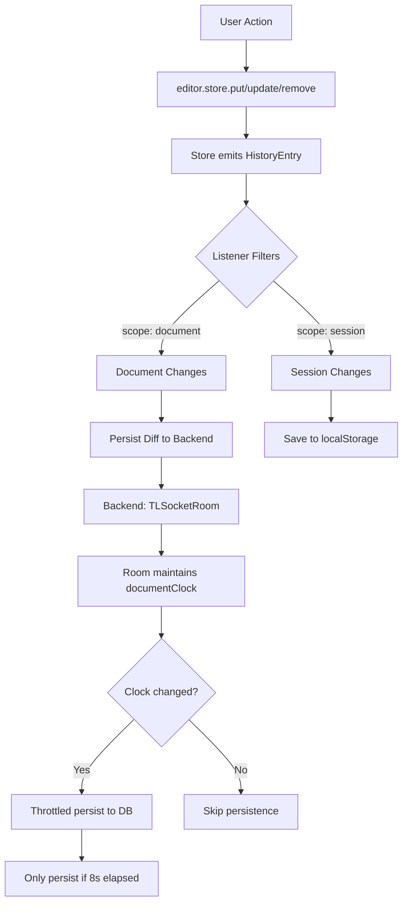
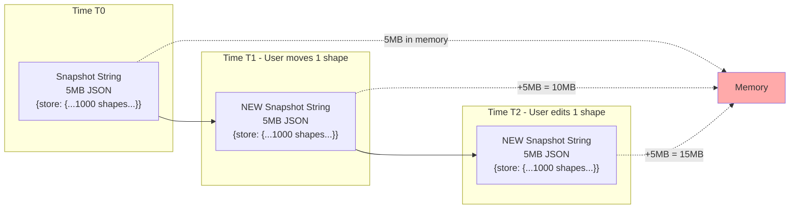
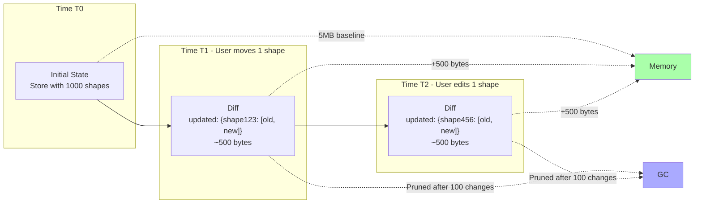

# TLDraw Persistence Analysis: Why Your Current Approach is Failing

## Executive Summary

Your current `useCanvasPersistence.ts` implementation has **fundamental architectural flaws** that cause memory leaks, performance degradation, and potential data loss. The primary issue is that you're treating TLDraw like a traditional React form where you periodically snapshot the entire state, rather than leveraging TLDraw's built-in incremental change tracking system.

---

## TLDraw's Design Philosophy: Incremental Changes

### Architecture Comparison

```mermaid
flowchart TB
    subgraph current["❌ Your Current Approach"]
        A1[User Edit] --> A2[store.listen fires]
        A2 --> A3[getSnapshot - FULL DOC]
        A3 --> A4[JSON.stringify - NEW STRING]
        A4 --> A5[Jazz: set snapshot]
        A5 --> A6[Jazz keeps version in memory]
        A6 --> A7[Memory accumulates]
        A7 -.-> A8[Eventually: Out of Memory]
    end
    
    subgraph correct["✅ TLDraw's Design"]
        B1[User Edit] --> B2[store.listen with diff]
        B2 --> B3[Extract only changed records]
        B3 --> B4[Check documentClock]
        B4 -->|Changed| B5[Throttled persist - 8s]
        B4 -->|Same| B6[Skip]
        B5 --> B7[Persist small diff]
        B7 --> B8[Prune old history]
        B8 -.-> B9[Bounded memory]
    end
    
    style current fill:#fee
    style correct fill:#efe
    style A8 fill:#fcc
    style B9 fill:#cfc
```



### How TLDraw Expects You to Persist

TLDraw's store is built on a **granular, incremental change model**:

```typescript
// TLDraw's internal structure
interface RecordsDiff<R> {
  added: Record<IdOf<R>, R>      // Only new records
  updated: Record<IdOf<R>, [from: R, to: R]>  // Only changed records
  removed: Record<IdOf<R>, R>    // Only deleted records
}
```

**Key insight**: TLDraw's `store.listen()` gives you **incremental diffs**, not full snapshots. This is by design for:
1. **Memory efficiency** - only track what changed
2. **Network efficiency** - only sync deltas
3. **Performance** - avoid serializing entire documents repeatedly

### The Recommended Pattern

```typescript
// ✅ CORRECT: Listen to incremental changes
const unlisten = editor.store.listen(
  (entry: HistoryEntry) => {
    // entry.changes contains ONLY the diff:
    // { added: {...}, updated: {...}, removed: {...} }
    
    persistDiff(entry.changes)  // Send only the diff
  },
  { scope: 'document', source: 'user' }
)
```

---

## Your Current Approach: Full Snapshot on Every Change

### What You're Doing

```typescript
// ❌ WRONG: Full snapshot on every change
unsubscribeRef.current = editor.store.listen(() => {
  scheduleSave()
})

const scheduleSave = () => {
  const snapshot = JSON.stringify(getSnapshot(editor.store))  // FULL SNAPSHOT
  canvasDoc.$jazz.set('snapshot', snapshot)
}
```

### The Problems

#### 1. **Memory Explosion**

Every single change (moving a shape, typing a letter, etc.) triggers:

```typescript
getSnapshot(editor.store)  // Serializes ENTIRE document
  ↓
JSON.stringify(...)  // Creates NEW string in memory
  ↓
canvasDoc.$jazz.set('snapshot', ...)  // Jazz keeps version history
```

**Result**: If you have 1000 shapes and make 100 edits:
- **Your approach**: 100 full snapshots × document size = **massive memory**
- **TLDraw approach**: 100 small diffs = **minimal memory**

#### 2. **No Cleanup of Old Snapshots**

Your code never clears old snapshots:

```typescript
// You do this repeatedly:
canvasDoc.$jazz.set('snapshot', newSnapshot)  // Old snapshot still in memory?
```

**TLDraw's approach**: The `Store` class maintains a `history` atom that is **bounded** and automatically prunes old entries. You're bypassing this entirely.

#### 3. **100ms Debounce is Ineffective**

```typescript
saveTimeoutRef.current = window.setTimeout(() => {
  // Full snapshot
}, 100)  // Only 100ms delay
```

**Why this fails**:
- Drawing a line generates **dozens of change events** per second
- Your 100ms debounce still results in **10 snapshots per second** during active editing
- Each snapshot is **the entire document** (could be MBs for complex canvases)

**TLDraw's approach**: Uses **throttled persistence** (8000ms = 8 seconds) and only persists when `documentClock` changes:

```typescript
const PERSIST_INTERVAL_MS = 8_000  // 8 seconds, not 100ms!

async persistToDatabase() {
  const clock = room.getCurrentDocumentClock()
  
  if (this._lastPersistedClock === clock) {
    return  // No changes since last persist
  }
  
  // Only persist if document actually changed
  await persistSnapshot(...)
  this._lastPersistedClock = clock
}
```

#### 4. **Race Conditions with Jazz Sync**

Jazz is **also syncing changes** in real-time. Your approach creates a conflict:

```typescript
// Change happens:
editor.store changes
  ↓
scheduleSave() triggered
  ↓
100ms later: full snapshot saved to Jazz
  ↓
Jazz syncs this massive snapshot
  ↓
Other clients receive massive update
```

But Jazz is **already syncing** the underlying CoValues! You're duplicating the entire sync mechanism.

---

## TLDraw's Architecture: How It Should Work

### The Store Lifecycle



### Memory Management

TLDraw uses **WeakCache** and **bounded history**:

```typescript
// From TLDraw docs:
class WeakCache<K extends object, V> {
  items: WeakMap<K, V>  // Automatically GC'd when K is unreferenced
}

// History is BOUNDED:
class HistoryManager {
  private maxStackSize = 100  // Only keep last 100 changes
  
  undo() {
    // Pops from bounded stack
  }
}
```

**Your approach**: Unbounded growth because every snapshot is a **new string** that Jazz must track.

---

## Why Jazz + TLDraw is Particularly Problematic

### The Double-Sync Problem

1. **TLDraw's internal sync**: Designed for `TLSocketRoom` (WebSocket-based incremental sync)
2. **Jazz's CRDT sync**: Already syncing all CoValues automatically

You're fighting against both:

```typescript
// What actually happens:
User edits shape
  ↓
TLDraw store changes (expects you to sync via TLSocketRoom)
  ↓
You ignore TLSocketRoom and instead:
  ↓
Create full snapshot
  ↓
Save to Jazz CoValue
  ↓
Jazz syncs CoValue (which contains ENTIRE snapshot)
  ↓
Other clients load ENTIRE snapshot
  ↓
loadSnapshot(editor.store, snapshot)  // Replaces entire document!
```

**Result**: Every change becomes a **full document replacement** instead of incremental merges.

---

## Data Structure Comparison

### Your Approach: Monolithic Snapshots


### TLDraw's Approach: Incremental Diffs


---

## The Correct Approach: Three Options

### Option 1: Use TLDraw's Built-in Persistence (Recommended)

TLDraw already has `persistenceKey` that uses **LocalIndexedDB**:

```typescript
// ✅ Simplest approach
<Tldraw persistenceKey="my-canvas" />
```

This handles:
- ✅ Incremental change tracking
- ✅ Bounded memory usage
- ✅ Cross-tab sync (via BroadcastChannel)
- ✅ Proper debouncing

**If you need Jazz**: Only sync **session state** or **metadata** to Jazz, not the full canvas.

### Option 2: Implement Proper Incremental Persistence

If you must persist to Jazz, do it correctly:

```typescript
export function useIncrementalPersistence(editor: Editor | null, jazzDoc: CoValue) {
  useEffect(() => {
    if (!editor) return
    
    const unlisten = editor.store.listen(
      (entry: HistoryEntry) => {
        // Only sync the DIFF, not full snapshot
        const { added, updated, removed } = entry.changes
        
        // Jazz should store these as separate CoMaps:
        Object.entries(added).forEach(([id, record]) => {
          jazzDoc.records?.[id]?.set(record)  // Granular update
        })
        
        Object.entries(updated).forEach(([id, [_from, to]]) => {
          jazzDoc.records?.[id]?.set(to)  // Granular update
        })
        
        Object.entries(removed).forEach(([id]) => {
          jazzDoc.records?.[id]?.delete()  // Granular delete
        })
      },
      { 
        scope: 'document',  // Only document changes
        source: 'user'      // Ignore remote changes to avoid loops
      }
    )
    
    return () => unlisten()
  }, [editor, jazzDoc])
}
```

### Option 3: Use TLDraw's Sync Package with Custom Backend

Use `@tldraw/sync` with a Jazz-backed WebSocket server:

```typescript
// Client:
import { useSync } from '@tldraw/sync'

const store = useSync({
  uri: 'wss://your-server.com/sync/room-123',
  assets: myAssetStore,
})

// Server (Jazz-backed):
import { TLSocketRoom } from '@tldraw/sync-core'

const room = new TLSocketRoom({
  onDataChange: () => {
    // Persist to Jazz only when room changes
    persistRoomToJazz(room.getCurrentSnapshot())
  }
})
```

This gives you:
- ✅ Proper incremental sync (TLDraw → WebSocket)
- ✅ Conflict resolution (TLSocketRoom handles it)
- ✅ Efficient persistence (only when `onDataChange` fires)

---

## Specific Issues in Your Code

### Issue 1: Listener Never Cleaned Up Properly

```typescript
// You do this:
useEffect(() => {
  unsubscribeRef.current = editor.store.listen(() => {
    scheduleSave()
  })
  
  return () => {
    if (unsubscribeRef.current) {
      unsubscribeRef.current()  // ✅ Good
    }
  }
}, [editor, canvasDoc, canWrite, intervalMs])
```

**Problem**: When `canvasDoc` changes, you create a **new listener** but the **old snapshots** are still in Jazz's memory.

### Issue 2: No Document Clock Tracking

```typescript
// You never check if document actually changed:
const snapshot = JSON.stringify(getSnapshot(editor.store))
const prev = (canvasDoc.snapshot ?? '') as string

if (snapshot !== prev) {  // ❌ String comparison is SLOW
  canvasDoc.$jazz.set('snapshot', snapshot)
}
```

**Better**:
```typescript
// Track document clock (like TLDraw does):
const currentClock = editor.store.history.get().clock

if (currentClock === lastPersistedClock) {
  return  // No changes
}
```

### Issue 3: Hydration Race Condition

```typescript
useEffect(() => {
  if (!editor) return
  if (!canvasDoc) return
  if (hydratedRef.current) return
  
  const raw = canvasDoc.snapshot as string | undefined
  if (raw) {
    const snap = JSON.parse(raw)
    loadSnapshot(editor.store, snap)  // ❌ What if this runs AFTER user makes changes?
    hydratedRef.current = true
  }
}, [editor, canvasDoc])
```

**Problem**: If the user makes changes before `canvasDoc` loads, you **overwrite** their changes.

**Solution**: Use `TLStoreWithStatus` pattern:

```typescript
const [storeWithStatus, setStoreWithStatus] = useState<TLStoreWithStatus>({
  status: 'loading',
})

useEffect(() => {
  async function loadStore() {
    const snapshot = await loadCanvasFromJazz()
    
    const store = createTLStore()
    loadSnapshot(store, snapshot)
    
    setStoreWithStatus({ status: 'ready', store })
  }
  
  loadStore()
}, [])

return <Tldraw store={storeWithStatus} />
```

---

## Memory Leak Visualization

```
Time:    0s    1s    2s    3s    4s    5s
         |     |     |     |     |     |
User:    [draw][move][edit][draw][move][edit]
         ↓     ↓     ↓     ↓     ↓     ↓
Your:    📦    📦    📦    📦    📦    📦   (6 full snapshots in memory)
TLDraw:  Δ     Δ     Δ     Δ     Δ     Δ    (6 small diffs, old ones pruned)
```

After 10 minutes of active editing:
- **Your approach**: 6000 full snapshots (potentially GBs of memory)
- **TLDraw approach**: ~100 diffs (bounded history, MBs at most)

---

## Recommendations

### Immediate Actions

1. **Stop using full snapshots on every change**
   - Remove the `store.listen(() => scheduleSave())` pattern
   - If you must persist, use a much longer debounce (5-10 seconds minimum)

2. **Implement snapshot cleanup**
   ```typescript
   // Before setting new snapshot:
   const oldSnapshot = canvasDoc.snapshot
   canvasDoc.$jazz.set('snapshot', newSnapshot)
   // TODO: Tell Jazz to GC oldSnapshot
   ```

3. **Use document clock to avoid redundant saves**
   ```typescript
   const clock = editor.store.history.get().clock
   if (clock === lastClock) return  // Skip
   ```

### Long-term Solution

**Option A**: Use TLDraw's built-in persistence + sync Jazz metadata only
```typescript
<Tldraw persistenceKey="canvas" />
// Sync only user info, permissions, etc. to Jazz
```

**Option B**: Implement proper incremental sync with Jazz
- Store canvas as individual CoMaps (one per record)
- Listen to granular changes only
- Use `mergeRemoteChanges()` for remote updates

**Option C**: Use `@tldraw/sync` with Jazz-backed WebSocket server
- Let TLDraw handle all sync logic
- Use Jazz only for persistence layer

---

## Further Reading

- [TLDraw Persistence Docs](https://tldraw.dev/docs/persistence)
- [TLDraw Sync Architecture](https://tldraw.dev/docs/sync)
- [TLDraw Store Internals](https://github.com/tldraw/tldraw/blob/main/packages/store/CONTEXT.md)
- [Jazz CRDT Documentation](https://jazz.tools/docs)

---

## Summary Table

| Aspect | Your Current Approach | TLDraw's Design | Impact |
|--------|----------------------|-----------------|--------|
| **Change Tracking** | Full snapshot | Incremental diffs | 100-1000x memory overhead |
| **Persistence Frequency** | Every change (100ms debounce) | Throttled (8s) + clock check | 80x more saves |
| **Memory Cleanup** | None | Bounded history + WeakCache | Memory leak |
| **Sync Strategy** | Replace entire document | Merge incremental changes | Loses concurrent edits |
| **Jazz Integration** | Store full snapshots | Should store granular records | Double-sync conflict |

**Bottom line**: You're using TLDraw as if it's a simple JSON document, but it's actually a sophisticated CRDT-like system with incremental change tracking. Respect its architecture or switch to a simpler canvas library.

