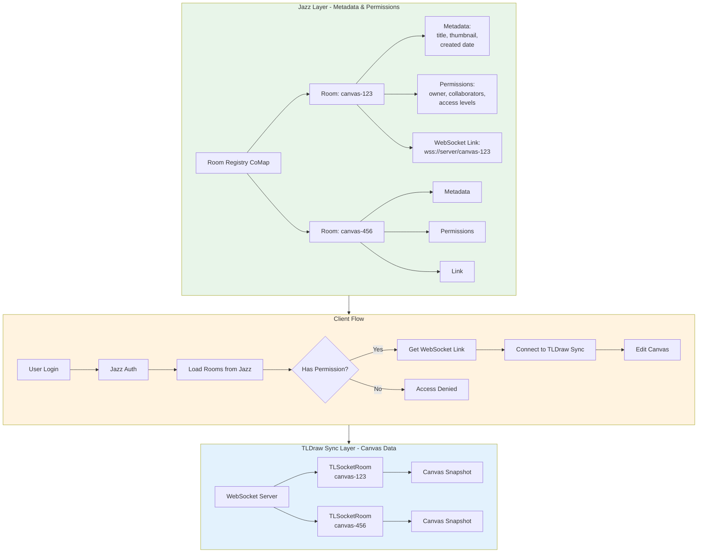

# Jazz + TLDraw: Room Management & Permission Architecture

## Part 1: Using Jazz to Manage Rooms & Permissions

**Yes, this is the ideal architecture!** Jazz is perfect for managing room metadata, links, and access control while TLDraw Sync handles the canvas itself.

### Architecture Overview



---

## Jazz Schema for Room Management

```typescript
// src/jazz/schema.ts
import { co, z } from 'jazz-tools'

// Room access level enum
export const RoomAccessLevel = z.enum(['owner', 'editor', 'viewer', 'commenter'])
export type RoomAccessLevel = z.infer<typeof RoomAccessLevel>

// Collaborator with granular permissions
export const RoomCollaborator = co.map({
  user: User,  // Reference to Jazz User
  accessLevel: RoomAccessLevel,
  invitedBy: User,
  invitedAt: z.date(),
  
  // Optional: Per-shape restrictions (more on this later)
  restrictedToShapes: co.optional(co.list(z.string())),  // Shape IDs
})

// Canvas Room metadata
export const CanvasRoom = co.map({
  // Identity
  id: z.string(),
  title: z.string(),
  description: z.optional(z.string()),
  
  // Visual metadata
  thumbnail: z.optional(z.string()),  // Base64 or URL
  
  // Permissions
  owner: User,
  collaborators: co.list(RoomCollaborator),
  isPublic: z.boolean(),
  
  // TLDraw Sync integration
  syncServerUrl: z.string(),  // e.g., "wss://your-server.com/canvas/123"
  roomId: z.string(),  // TLSocketRoom ID
  
  // Timestamps
  createdAt: z.date(),
  updatedAt: z.date(),
  lastEditedBy: co.optional(User),
  
  // Optional: Arena integration
  arenaChannelId: co.optional(z.string()),
  arenaBlocks: co.optional(co.list(co.map({
    blockId: z.string(),
    shapeId: z.string(),  // TLDraw shape ID
    position: co.map({ x: z.number(), y: z.number() }),
  }))),
  
  // Optional: Version/snapshot reference (for backup)
  latestSnapshotId: co.optional(z.string()),
  snapshotBackupTimestamp: co.optional(z.date()),
})

// Root Account schema with room index
export const AccountRoot = co.map({
  // User's owned rooms
  ownedRooms: co.list(CanvasRoom),
  
  // Rooms shared with user (via collaborator invites)
  sharedRooms: co.list(CanvasRoom),
  
  // User preferences
  preferences: co.map({
    defaultRoomTemplate: co.optional(z.string()),
    theme: z.enum(['light', 'dark', 'system']),
  }),
})

export const Account = co.account({
  root: AccountRoot,
  profile: co.map({
    name: z.string(),
    color: z.string(),  // For TLDraw presence
    avatar: co.optional(z.string()),
  }),
}).withMigration((account, creationProps?: { name: string }) => {
  if (account.root === undefined) {
    account.root = AccountRoot.create({
      ownedRooms: co.list(CanvasRoom).create([]),
      sharedRooms: co.list(CanvasRoom).create([]),
      preferences: co.map({
        theme: z.enum(['light', 'dark', 'system']),
      }).create({ theme: 'system' }),
    })
  }
})
```

---

## Client Implementation

### 1. Room List Component

```typescript
// src/components/RoomList.tsx
import { useAccount } from 'jazz-tools/react'
import { Account, CanvasRoom } from '../jazz/schema'

export function RoomList() {
  const { me } = useAccount(Account, {
    resolve: {
      root: {
        ownedRooms: { $each: { owner: true, collaborators: { $each: true } } },
        sharedRooms: { $each: { owner: true, collaborators: { $each: true } } },
      },
    },
  })
  
  if (!me?.root) return <div>Loading...</div>
  
  const allRooms = [
    ...me.root.ownedRooms,
    ...me.root.sharedRooms,
  ]
  
  return (
    <div className="room-grid">
      {allRooms.map(room => (
        <RoomCard 
          key={room.id} 
          room={room}
          userAccess={getUserAccessLevel(room, me.id)}
        />
      ))}
      
      <button onClick={() => createNewRoom(me)}>
        + New Canvas
      </button>
    </div>
  )
}

function getUserAccessLevel(room: CanvasRoom, userId: string): RoomAccessLevel {
  if (room.owner.id === userId) return 'owner'
  
  const collaborator = room.collaborators.find(c => c.user.id === userId)
  return collaborator?.accessLevel ?? 'viewer'
}
```

### 2. Room Access Hook

```typescript
// src/hooks/useRoomAccess.ts
import { useAccount } from 'jazz-tools/react'
import { useSync } from '@tldraw/sync'
import { Account, CanvasRoom } from '../jazz/schema'

export function useRoomAccess(roomId: string) {
  const { me } = useAccount(Account)
  const [room, setRoom] = useState<CanvasRoom | null>(null)
  const [accessLevel, setAccessLevel] = useState<RoomAccessLevel | null>(null)
  
  // Load room from Jazz
  useEffect(() => {
    if (!me) return
    
    async function loadRoom() {
      const loadedRoom = await CanvasRoom.load(roomId)
      
      if (!loadedRoom) {
        throw new Error('Room not found')
      }
      
      // Check permissions
      const userAccess = getUserAccessLevel(loadedRoom, me.id)
      if (!userAccess) {
        throw new Error('Access denied')
      }
      
      setRoom(loadedRoom)
      setAccessLevel(userAccess)
    }
    
    loadRoom()
  }, [roomId, me])
  
  // Connect to TLDraw Sync ONLY if user has access
  const store = useSync({
    uri: async () => {
      if (!room || !me) throw new Error('Not ready')
      
      // Get auth token from Jazz
      const token = await me.sessionToken()
      
      // Connect to TLDraw sync server with auth
      return `${room.syncServerUrl}?token=${token}&roomId=${room.roomId}`
    },
    
    userInfo: {
      id: me?.id ?? 'anonymous',
      name: me?.profile?.name ?? 'Anonymous',
      color: me?.profile?.color ?? '#000000',
    },
    
    assets: jazzAssetStore,
  })
  
  return {
    room,
    accessLevel,
    store,
    canEdit: accessLevel === 'owner' || accessLevel === 'editor',
    canComment: accessLevel !== 'viewer',
  }
}
```

### 3. Canvas Component with Permissions

```typescript
// src/components/Canvas.tsx
import { Tldraw } from 'tldraw'
import { useRoomAccess } from '../hooks/useRoomAccess'

export function Canvas({ roomId }: { roomId: string }) {
  const { room, store, accessLevel, canEdit } = useRoomAccess(roomId)
  
  if (store.status === 'loading') {
    return <LoadingSpinner />
  }
  
  if (store.status === 'error') {
    return <ErrorView error={store.error} />
  }
  
  return (
    <div className="canvas-container">
      <RoomHeader room={room} accessLevel={accessLevel} />
      
      <Tldraw 
        store={store.store}
        
        // Enforce read-only mode for viewers
        onMount={(editor) => {
          if (!canEdit) {
            editor.updateInstanceState({ isReadonly: true })
          }
        }}
      />
      
      {accessLevel === 'viewer' && (
        <div className="viewer-notice">
          👁️ View-only mode. Ask owner for edit access.
        </div>
      )}
    </div>
  )
}
```

---

## Server-Side Permission Enforcement

```typescript
// server/websocket-handler.ts
import { WebSocketServer } from 'ws'
import { CanvasRoom } from './jazz-schema'

wss.on('connection', async (ws, req) => {
  const url = new URL(req.url!, 'wss://localhost')
  const roomId = url.searchParams.get('roomId')
  const token = url.searchParams.get('token')
  
  // 1. Verify Jazz token
  const userId = await verifyJazzToken(token)
  if (!userId) {
    ws.close(1008, 'Unauthorized')
    return
  }
  
  // 2. Load room from Jazz
  const jazzRoom = await CanvasRoom.load(roomId!)
  if (!jazzRoom) {
    ws.close(1008, 'Room not found')
    return
  }
  
  // 3. Check user permissions
  const userAccess = getUserAccessLevel(jazzRoom, userId)
  if (!userAccess) {
    ws.close(1008, 'Access denied')
    return
  }
  
  // 4. Determine read-only mode
  const isReadOnly = userAccess === 'viewer'
  
  // 5. Connect to TLSocketRoom
  const tlRoom = await getTLSocketRoom(roomId!)
  
  tlRoom.handleSocketConnect({
    sessionId: generateSessionId(),
    socket: ws,
    isReadonly: isReadOnly,  // TLDraw enforces this
    meta: { 
      userId,
      accessLevel: userAccess,
    },
  })
})
```

---

## Part 2: TLDraw Permission Granularity

### What TLDraw Supports Out of the Box

**Room/File-Level Permissions:**
- ✅ **Read-only mode**: `isReadonly: true` in `handleSocketConnect()`
- ✅ **Entire canvas** is locked for viewing only
- ✅ **Server enforces** this at the WebSocket level

**Shape-Level Features (NOT per-user permissions):**
- ✅ **Locked shapes**: `shape.isLocked` prevents editing by ALL users
- ✅ **Hidden shapes**: `getShapeVisibility` prop hides shapes from ALL users
- ✅ **Shape metadata**: `shape.meta` can store custom data

### What TLDraw Does NOT Support

❌ **Per-shape, per-user permissions**
- Cannot restrict specific shapes to specific users
- Cannot make shape visible to only certain users
- Cannot allow User A to edit Shape 1 but not Shape 2

### Why This Limitation Exists

TLDraw is designed for **collaborative editing** where:
- All editors see the same canvas
- All editors can edit all shapes (or none)
- Permissions are **coarse-grained** (room-level)

This is intentional because:
1. **Sync complexity**: Per-shape permissions require complex conflict resolution
2. **UX confusion**: Users expect to see what others see
3. **Performance**: Per-shape permission checks on every edit would be slow

---

## Workarounds for Granular Permissions

### Option 1: Metadata + Side Effects (Soft Enforcement)

```typescript
// Mark shapes with owner in metadata
const restrictedShape = editor.createShape({
  type: 'geo',
  x: 100,
  y: 100,
  meta: {
    ownerId: 'user-123',
    accessLevel: 'restricted',
  },
})

// Enforce on client via side effects
editor.sideEffects.registerBeforeChangeHandler('shape', (prev, next, source) => {
  // Check if current user can edit this shape
  if (next.meta.ownerId && next.meta.ownerId !== currentUserId) {
    console.warn('Cannot edit shape owned by another user')
    return prev  // Revert change
  }
  return next
})
```

**Limitations:**
- ❌ **Client-side only** (not secure - can be bypassed)
- ❌ **No server enforcement**
- ❌ **UX is confusing** (shape appears editable but reverts)

### Option 2: Visibility Filtering (Hide Shapes)

```typescript
// Hide shapes user doesn't have access to
<Tldraw
  getShapeVisibility={(shape) => {
    const ownerId = shape.meta.ownerId
    if (ownerId && ownerId !== currentUserId) {
      return 'hidden'
    }
    return 'inherit'
  }}
  
  onMount={(editor) => {
    // Prevent selecting hidden shapes
    return react('clean up selection', () => {
      const selectedIds = editor.getSelectedShapeIds()
      const visible = selectedIds.filter(id => {
        const shape = editor.getShape(id)
        return !shape?.meta.ownerId || shape.meta.ownerId === currentUserId
      })
      if (visible.length !== selectedIds.length) {
        editor.setSelectedShapes(visible)
      }
    })
  }}
/>
```

**Better, but:**
- ✅ Hides shapes from unauthorized users
- ❌ Still **client-side only**
- ❌ **Shapes still sync** to all users (just hidden in UI)
- ❌ Can be inspected in browser devtools

### Option 3: Separate Rooms (True Isolation)

**The only secure approach:**

```typescript
// Jazz schema with per-shape rooms
export const CollaborativeProject = co.map({
  title: z.string(),
  
  // Each "shape" is actually a separate TLDraw room
  layers: co.list(co.map({
    layerId: z.string(),
    name: z.string(),
    roomId: z.string(),  // Separate TLSocketRoom
    permissions: co.list(RoomCollaborator),
  })),
})

// User only connects to rooms they have access to
function LayeredCanvas({ projectId }) {
  const project = useCollaborativeProject(projectId)
  
  // Only load layers user has access to
  const accessibleLayers = project.layers.filter(layer => 
    userHasAccess(layer, currentUserId)
  )
  
  return (
    <div className="layered-canvas">
      {accessibleLayers.map(layer => (
        <TldrawLayer
          key={layer.layerId}
          roomId={layer.roomId}  // Separate sync connection
          style={{ position: 'absolute', zIndex: layer.zIndex }}
        />
      ))}
    </div>
  )
}
```

**Pros:**
- ✅ **True isolation** (shapes in separate rooms)
- ✅ **Server-enforced** (can't access room without permission)
- ✅ **Secure** (no client-side bypass)

**Cons:**
- ❌ **Complex architecture** (multiple WebSocket connections)
- ❌ **Not truly "one canvas"** (layers are separate)
- ❌ **Performance overhead** (N rooms = N connections)

---

## Recommendation for Your Use Case

Based on your Arena integration needs:

### Use Jazz for Room-Level Permissions

```typescript
export const CanvasRoom = co.map({
  // ... other fields
  
  collaborators: co.list(RoomCollaborator),
  
  // Access levels:
  // - 'owner': Full control, can invite others
  // - 'editor': Can edit canvas
  // - 'commenter': Can add comments/annotations (custom feature)
  // - 'viewer': Read-only
})
```

### For Arena Block Shapes: Use Shape Metadata

```typescript
// Mark shapes that came from Arena
const arenaShape = editor.createShape({
  type: 'custom-arena-block',
  meta: {
    arenaBlockId: 'block-123',
    arenaChannelId: 'channel-456',
    isArenaContent: true,
    // Everyone can see, but only channel owner can remove
    canRemove: ['channel-owner-id'],
  },
})

// Soft enforcement via side effects
editor.sideEffects.registerBeforeDeleteHandler('shape', (shape) => {
  if (shape.meta.isArenaContent) {
    const canRemove = shape.meta.canRemove ?? []
    if (!canRemove.includes(currentUserId)) {
      alert('Only channel owner can remove Arena blocks')
      return false  // Prevent deletion
    }
  }
})
```

---

## Summary

### Jazz + TLDraw Integration

| Layer | Responsibility | Technology |
|-------|---------------|------------|
| **Room Registry** | List of all rooms, metadata, thumbnails | Jazz CoMaps |
| **Access Control** | Who can access which room, at what level | Jazz permissions |
| **Canvas Sync** | Real-time shape editing, cursor presence | TLDraw Sync |
| **Shape Data** | Actual canvas content, snapshots | TLSocketRoom + R2 |
| **Assets** | Images, videos | Jazz ImageDefinition or R2 |

### Permission Granularity

| Level | TLDraw Support | Recommendation |
|-------|---------------|----------------|
| **Room-level** | ✅ Built-in (readonly mode) | Use this + Jazz |
| **User-level** | ✅ Built-in (owner/editor/viewer) | Jazz manages this |
| **Shape-level** | ❌ Not supported | Use metadata + soft enforcement OR separate rooms |
| **Per-shape, per-user** | ❌ Not supported | Requires separate rooms (complex) |

**Bottom line**: Use **Jazz for room management and permissions**, **TLDraw Sync for canvas collaboration**, and accept that shape-level permissions are **client-side hints only**, not server-enforced (unless you use separate rooms).

