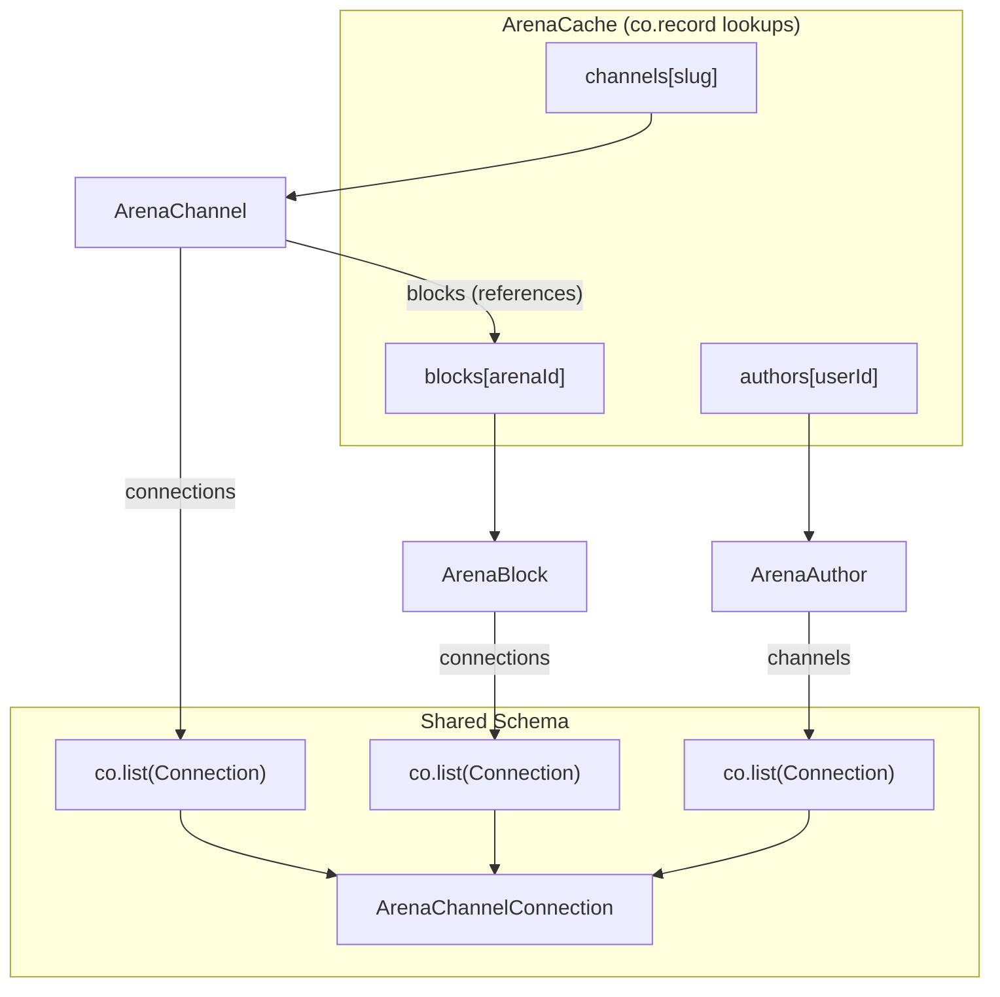

# Plan: Global Registry with co.record

This plan refactors `ArenaCache` to use `co.record` for channels, authors, **and blocks**, eliminating O(N) traversals and ensuring block deduplication across channels.

## Status: Complete ✅

**All steps implemented:**
1. ✅ Schema updated with `co.record` for channels, blocks, authors
2. ✅ `channelSync` uses global blocks registry
3. ✅ All hooks updated for O(1) lookups
4. ✅ Shared `syncConnectionList` utility extracted
5. ✅ Author sync + `useAuthorMetadata` hook

---

## 1. Problem Statement

**Arena Data Model**: Blocks have globally unique IDs. The same block can appear in multiple channels (via "connections").

**Previous Architecture**:
```typescript
ArenaCache.channels: co.list(ArenaChannel)  // O(N) lookup
ArenaChannel.blocks: co.list(ArenaBlock)    // Duplicated across channels
```

**Problems**:
1. O(N) scans to find channels by slug
2. O(N×M) scans to find a block across channels
3. **Data Duplication**: Same Arena block in multiple channels creates multiple Jazz CoValues
4. **Fragmented State**: Metadata synced for block in Channel A isn't visible from Channel B

## 2. Solution: Global Registries

```typescript
export const ArenaCache = co.map({
  // O(1) lookup by channel slug
  channels: co.record(z.string(), ArenaChannel),
  
  // O(1) lookup by user ID
  authors: co.record(z.string(), ArenaAuthor),
  
  // O(1) lookup by Arena block ID (GLOBAL)
  blocks: co.record(z.string(), ArenaBlock),
  
  // Ordering for "my channels" UI
  myChannelIds: co.list(z.string()),
  
  pendingOps: co.list(ArenaPendingOp),
  lastOnlineAt: z.number().optional(),
})
```

### Why Global Blocks Registry?

- Same Arena block ID appears in multiple channels → must be single CoValue
- `block.connections` (channels containing this block) is block-level data
- `block.user`, `block.createdAt` are immutable per-block facts
- Enables O(1) lookup without knowing which channel

## 3. Reference Mechanics

In Jazz, `co.list(ArenaBlock)` stores **references** (pointers), not copies.

```typescript
// Create block in global registry
const block = ArenaBlock.create({ arenaId: 12345, ... })
cache.blocks.$jazz.set("12345", block)

// Push SAME reference to multiple channels
channelA.blocks.$jazz.push(block)
channelB.blocks.$jazz.push(block)

// All three point to the SAME CoValue:
cache.blocks["12345"].$jazz.id === channelA.blocks[0].$jazz.id // true
```

### Sync Pattern

```typescript
// In channelSync, when processing API response:
for (const apiBlock of apiResponse.contents) {
  const arenaId = String(apiBlock.id)
  
  // Check global registry first
  let block = cache.blocks[arenaId]
  
  if (!block) {
    // Create once, add to registry
    block = ArenaBlock.create({ arenaId: apiBlock.id, ... })
    cache.blocks.$jazz.set(arenaId, block)
  } else {
    // Update mutable fields if needed (aspect, etc.)
    if (!block.aspect && apiBlock.image) {
      // measure and update
    }
  }
  
  // Push reference to channel's list
  channel.blocks.$jazz.push(block)
}
```

## 4. Schema Evolution

### ArenaAuthor (Expanded)
```typescript
export const ArenaAuthor = co.map({
  id: z.number(),
  username: z.string().optional(),
  fullName: z.string().optional(),
  avatarThumb: z.string().optional(),
  
  // Profile Metadata
  bio: z.string().optional(),
  followerCount: z.number().optional(),
  followingCount: z.number().optional(),
  channelCount: z.number().optional(),
  
  // Channel List (using shared schema)
  channels: co.list(ArenaChannelConnection).optional(),
  
  // Sync Bookkeeping
  lastFetchedAt: z.number().optional(),
  error: z.string().optional(),
})
```

### ArenaChannelConnection (Shared)
Used for:
- `block.connections` — channels containing this block
- `channel.connections` — related channels
- `author.channels` — user's channel list

All three use the same schema, enabling shared sync logic.

## 5. Hook Simplifications

### useBlockMetadata(blockId)

**Before** (O(N channels × M blocks)):
```typescript
const channel = cache.channels.find(c => c.slug === channelSlug)
const block = channel.blocks.find(b => b.arenaId === blockId)
```

**After** (O(1), no channel slug needed!):
```typescript
const block = cache?.blocks?.[String(blockId)]
```

### useArenaChannelStream(slug)

**Before** (O(N)):
```typescript
const channel = cache.channels.find(c => c.slug === slug)
```

**After** (O(1)):
```typescript
const channel = cache?.channels?.[slug]
```

### useAuthorMetadata(userId)

**After** (O(1)):
```typescript
const author = cache?.authors?.[String(userId)]
```

## 6. Shared Sync Logic

All three entities need to populate a `co.list(ArenaChannelConnection)`:

```typescript
// src/arena/utils/syncConnectionList.ts
export async function syncConnectionList(
  targetList: co.List<ArenaChannelConnection>,
  fetchPage: (page: number, per: number) => Promise<{ channels: any[], total_pages: number }>,
  opts: { owner?: any; signal?: AbortSignal }
): Promise<void>
```

**Consumers**:
- `channelSync` → `fetchChannelConnectionsPage`
- `blockSync` → `fetchBlockConnectionsPage`
- `authorSync` → `fetchUserChannelsPage`

## 7. Implementation Order

1. **Schema**: Update `ArenaCache` with three `co.record` fields
2. **channelSync**: Refactor to use global blocks registry
3. **Hooks**: Update `useArenaChannelStream`, `useBlockMetadata`, `useChannelMetadata`
4. **Shared Utility**: Extract `syncConnectionList`
5. **Author**: Implement `authorSync` + `useAuthorMetadata`

## 8. Architecture Diagram



## 9. Data Flow Example

**User opens Channel A containing block 12345**:
1. `useArenaChannelStream("channel-a")` → `cache.channels["channel-a"]`
2. `channelSync` fetches contents, finds block 12345 not in registry
3. Creates `ArenaBlock`, adds to `cache.blocks["12345"]`
4. Pushes reference to `channel.blocks`

**User opens Channel B (also contains block 12345)**:
1. `useArenaChannelStream("channel-b")` → `cache.channels["channel-b"]`
2. `channelSync` fetches contents, finds block 12345 **already in registry**
3. Reuses existing reference, pushes to `channel.blocks`

**User focuses block 12345 from Channel B**:
1. `useBlockMetadata(12345)` → `cache.blocks["12345"]` (O(1))
2. Same CoValue that was synced from Channel A
3. All metadata + connections already available

## 10. Migration Notes

Since we haven't launched:
- Wipe IndexedDB during development
- No migration logic needed
- Fresh sync rebuilds cache correctly

---

## 11. Implementation Notes (Completed)

### Key Jazz Patterns Learned

**1. co.record Access Pattern**
```typescript
// Check if record is loaded, then type-cast for key access
if (!cache.blocks.$isLoaded) return
const blocksRecord = cache.blocks as typeof cache.blocks & Record<string, LoadedArenaBlock | undefined>
const block = blocksRecord[arenaId]
```

**2. co.record Set Pattern**
```typescript
cache.blocks.$jazz.set(arenaId, block)  // O(1) insert
cache.channels.$jazz.set(slug, channel) // Key = string
```

**3. Hook Pattern: ID Lookup → Subscription**
```typescript
// Step 1: Get cache ID from account
const cacheId = me.root?.arenaCache?.$jazz.id

// Step 2: Subscribe to cache (shallow)
const cache = useCoState(ArenaCache, cacheId, { resolve: { blocks: true } })

// Step 3: O(1) lookup to get Jazz ID
const blockJazzId = cache.blocks[String(blockId)]?.$jazz.id

// Step 4: Subscribe to the specific entity
const block = useCoState(ArenaBlock, blockJazzId, { resolve: { ... } })
```

**4. Circular Reference with Getter**
```typescript
export const ArenaAuthor = co.map({
  id: z.number(),
  // Getter required for forward reference to ArenaChannelConnection
  get channels(): co.Optional<co.List<typeof ArenaChannelConnection>> {
    return co.optional(co.list(ArenaChannelConnection))
  },
})
```

**5. Preventing Effect Re-runs During Sync**
```typescript
// Track if sync already started for this slug
const syncStartedForSlugRef = useRef<string | null>(null)

useEffect(() => {
  if (syncStartedForSlugRef.current === slug) return // Already syncing
  syncStartedForSlugRef.current = slug
  // ... start sync
}, [/* stable deps only - NOT data that changes during sync */])
```

### Files Modified (Steps 1-3)

| File | Change |
|------|--------|
| `src/jazz/schema.ts` | `ArenaCache` with 3 `co.record` fields, expanded `ArenaAuthor` |
| `src/arena/channelSync.ts` | `syncChannel(cache, channel, slug)` uses global blocks registry |
| `src/arena/hooks/useArenaChannelStream.ts` | O(1) channel lookup/creation |
| `src/arena/hooks/useBlockMetadata.ts` | O(1) block lookup, removed `channelSlug` param |
| `src/arena/hooks/useChannelMetadata.ts` | O(1) channel lookup |
| `src/shapes/components/PortalMetadataPanel.tsx` | Updated `useBlockMetadata` call |

### Files Added (Steps 4-5)

| File | Purpose |
|------|---------|
| `src/arena/utils/syncConnectionList.ts` | Shared paginated connection list sync utility |
| `src/arena/authorSync.ts` | Author profile + channels sync to global registry |
| `src/arena/hooks/useAuthorMetadata.ts` | O(1) author lookup with auto-sync |
| `src/arena/arenaClient.ts` | Added `fetchUserDetails`, `fetchUserChannelsPage` |

### syncConnectionList Usage

```typescript
// All three use the same utility:
// 1. Channel connections
await syncConnectionList(
  {
    connections: channel.connections,
    owner: channel.$jazz.owner,
    setLastFetched: (ts) => channel.$jazz.set('connectionsLastFetchedAt', ts),
    setError: (err) => channel.$jazz.set('connectionsError', err),
  },
  (page, per, signal) => fetchChannelConnectionsPage(channelId, page, per, { signal }),
  { per: 50, signal }
)

// 2. Block connections (same pattern)
// 3. Author channels (same pattern)
```

### useAuthorMetadata Usage

```typescript
// O(1) lookup + auto-sync when stale/missing
const author = useAuthorMetadata(userId)

if (author === undefined) return <Loading />
if (author === null) return <NotFound />

// author.channels is the user's channel list
// author.bio, author.followerCount, etc.
```
