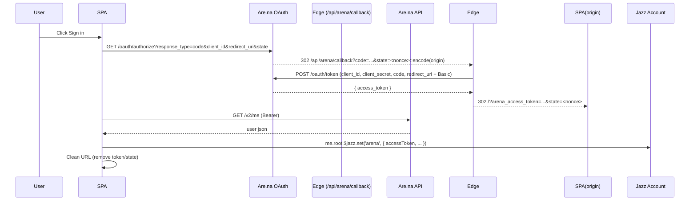

## Are.na Auth (Code Flow) — Integration Guide

This app uses Are.na OAuth with authorization code flow and a Vercel Edge Function for the token exchange.

Reference: [Are.na Authentication](https://dev.are.na/documentation/authentication)

### High-level flow



### Files and responsibilities

- `src/arena/auth.ts`
  - `getArenaConfig()` reads client env (VITE_ARENA_*).
  - `buildArenaAuthorizeUrl(state)` builds code-flow authorize URL; encodes the SPA origin in `state`.
  - `parseArenaTokenFromSearch()` and `parseArenaTokenFromHash()` extract tokens from URL.
  - `fetchArenaMe(token)` calls `https://api.are.na/v2/me`.

- `api/arena/callback.ts` (Vercel Edge)
  - Accepts `code` + `state`.
  - Exchanges the code at `https://dev.are.na/oauth/token` using form params and HTTP Basic auth with `ARENA_CLIENT_ID/ARENA_CLIENT_SECRET`.
  - Decodes the return origin from `state` and redirects to `/?arena_access_token=...` on that origin.

- `src/arena/useArenaAuth.ts`
  - React hook managing auth state.
  - On mount: reads token from query or hash; fetches `/v2/me`; persists identity to `me.root.$jazz.set('arena', ...)`; stores token to `localStorage`; cleans URL.
  - On boot: if Jazz lacks a token, falls back to `localStorage` and re-persists.
  - Provides `{ state, login(), logout(), refresh() }`.
  - Uses Jazz 0.18 idioms (`$jazz.set`, `$jazz.delete`).

- `src/jazz/schema.ts`
  - `Root` includes optional `arena` map: `{ accessToken?, userId?, slug?, name?, avatarUrl?, authorizedAt? }`.
  - `Account.withMigration` ensures `root` exists.

- `src/examples/SlideShowTrackExample.tsx`
  - `CustomToolbar()` contains Radix UI popovers for Are.na search and profile/login.
  - Uses `useArenaAuth()` to show sign-in/profile/logout.

- `src/arena/api.ts`
  - Are.na data fetches; `getAuthHeaders()` reads `VITE_ARENA_ACCESS_TOKEN` (dev override) or `localStorage` token.

- `vite.config.ts`
  - HTTPS in dev via `@vitejs/plugin-basic-ssl` (optional convenience).

### Environment variables

- Client (Vite; set in Vercel + `.env.local`):
  - `VITE_ARENA_CLIENT_ID=YOUR_UID`
  - `VITE_ARENA_REDIRECT_URI=https://YOUR-VERCEL-DOMAIN/api/arena/callback`
  - `VITE_ARENA_AUTH_HOST=https://dev.are.na` (optional)
  - `VITE_ARENA_API_BASE=https://api.are.na/v2` (optional)

- Server (Vercel Project env; Edge Function):
  - `ARENA_CLIENT_ID=YOUR_UID`
  - `ARENA_CLIENT_SECRET=YOUR_SECRET`
  - `ARENA_AUTH_HOST=https://dev.are.na` (optional)

- Are.na app settings (callbacks):
  - `https://YOUR-VERCEL-DOMAIN/api/arena/callback`

### Jazz 0.18 mutation idioms

- Use `$jazz.set` and `$jazz.delete` instead of direct assignment:

```ts
// Set or update
me.root.$jazz.set('arena', { accessToken, userId, slug, name, avatarUrl, authorizedAt: Date.now() })

// Remove
me.root.$jazz.delete('arena')
```

### Troubleshooting

- 401 invalid_client at `/oauth/token`:
  - `redirect_uri` must exactly match the one used in authorize and registered in Are.na (scheme/host/path).
  - Verify `ARENA_CLIENT_ID/ARENA_CLIENT_SECRET` on Vercel; redeploy after changes.
  - Try rotating the Secret in Are.na and updating Vercel env.

- Stuck “logged out” after redirect:
  - Confirm `arenaAccessToken` in Local Storage.
  - Check Network: `GET /v2/me` should succeed.
  - Ensure URL parameters are present (query or hash) on first load post-redirect; the hook will clean them after persisting.

### Test checklist

- Authorize URL contains `client_id=YOUR_UID` and `redirect_uri=https%3A%2F%2FYOUR-VERCEL-DOMAIN%2Fapi%2Farena%2Fcallback`.
- Callback hits Edge Function and returns to `/?arena_access_token=...` on your origin.
- Profile popover shows Are.na identity; token stored under `me.root.arena.accessToken` and in `localStorage`.


