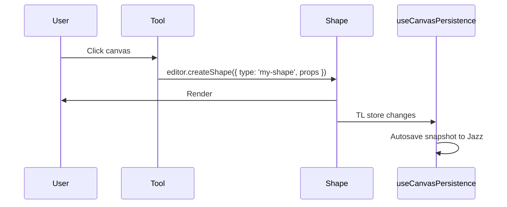

## TLDraw Custom Shapes & Tools — Minimal Guide (with Jazz Persistence)

This guide shows how to build a simple custom shape and a custom tool in TLDraw, and how it cooperates with Jazz persistence via `useCanvasPersistence`.

### Concepts
- **ShapeUtil**: declares a shape type, its props schema, default props, geometry, resize, and React renderer.
- **Tool (StateNode)**: a state-machine node that handles input (pointer/keys) to create/update shapes.
- **Registration**: pass `shapeUtils={[...MyShapeUtils]}` and `tools={[...MyTools]}` to `<Tldraw />`. Use `overrides.tools` to add a toolbar button/shortcut.
- **Persistence**: Save/restore the TLDraw store using `getSnapshot`/`loadSnapshot`. In this app, `useCanvasPersistence(editor, key)` already persists snapshots to Jazz `CanvasDoc.snapshot`.

### Minimal steps
1) Define the shape util
   - Pick a unique `type` string.
   - Define `props` via `T.*` validators.
   - Render with `HTMLContainer` and implement `indicator` and `getGeometry`.

2) Define a tool (optional but recommended)
   - Extend `StateNode`; set `static id` to your tool id.
   - In `onPointerDown`, create a shape at `editor.inputs.currentPagePoint`.

3) Register in TLDraw
   - `<Tldraw shapeUtils={[MyShapeUtil]} tools={[MyTool]} />`.
   - Optionally add `overrides.tools` to put a button in the toolbar and a keyboard shortcut.

4) Persistence
   - Do not store live objects in shape props—store IDs/strings/numbers.
   - `useCanvasPersistence` autosaves snapshots; your custom shapes are just part of the snapshot.

### With Jazz binaries (audio/images)
- Store only the Jazz value ID (e.g., `audioId`) in the shape props. Subscribe in the shape renderer when needed.
- Use the account’s owner group when creating the binary, consistent with `CanvasDoc` creation.
- Follow tri‑state rules: `undefined` (loading), `null` (no access), instance (ready).

### Tips
- Keep shape props small and serializable.
- Use `resizeBox` in `onResize` for rectangular shapes.
- For Jazz: mutate with `$jazz` methods only; never fetch manually for app data.

